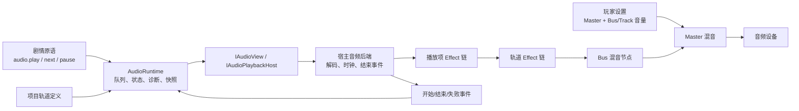

# GalNet 音频系统设计

> 状态：设计稿。对应 [Avalonia 游戏页面与内容对接计划](avalonia-game-page-integration-plan.md) 的 Phase 4；本文不代表已实现的接口或行为。

## 目标与边界

音频系统让项目作者在编辑器中定义任意数量的逻辑轨道，并由剧情原语以轨道为单位控制音频资源的播放、队列和音量。默认项目创建三个轨道：`bgm`、`sfx`、`vocal`。它必须同时满足：

- 作者可以增加、删除、排序和命名轨道，运行时只以稳定的轨道 ID 寻址；
- BGM、音效、语音可以并行播放；短音效不会因使用同一 `sfx` 轨道而互相打断；
- 播放队列、顺序/随机选择、暂停、继续、跳过下一首具有确定的语义；
- 玩家音量偏好与作者混音值分离；
- Runtime / Core 不依赖 Avalonia、LibVLC、Skia 或具体文件路径；
- 音频处理效果可以附着在轨道或单个播放项上；声明为可动画的参数只允许在轨道 Effect 上由通用动画体系驱动；
- 运行时可诊断无效内容而不因普通内容错误崩溃，存档恢复有明确的降级规则。

第一版的非目标：空间化场景建模、实时录音、任意 VST/AU 插件、网络同步播放、精确逐样本的跨设备恢复。淡入淡出和单声部轨道的交叉淡化属于 Phase 4 的播放项模型；ducking、循环区间与 Effect 参数自动化可预留数据模型，但不应阻塞基本播放。

## 术语

| 术语 | 含义 |
| --- | --- |
| **混音总线（bus）** | 用于玩家音量设置和全局处理的一组声音，如 BGM、SFX、Vocal。一个轨道属于一个 bus。 |
| **轨道（track）** | 作者可配置、剧情原语直接寻址的逻辑播放单元，拥有队列、选择规则、音量和效果链。 |
| **声部（voice）** | 后端实际解码/输出的一个同时播放实例。一个单声部轨道通常只有一个当前项；SFX 轨道可有多个声部。 |
| **播放项（item）** | 队列中的一次播放请求，引用一个音频资源并携带本次音量、循环和完成策略。 |
| **放置策略（placement）** | 新播放项如何进入轨道：入队、下一首、替换当前或替换全部。 |
| **选择模式（selection mode）** | 队列在需要下一项时按顺序取出还是随机取出。 |
| **音频 Effect** | 对 PCM/采样流或混音节点施加的处理器，如低通、声像、均衡、空间化。与图像 Effect 同为可配置实例，但不进入图像渲染管线。 |

`sfx` 不应被理解为“只允许一个声音的音效轨道”。默认 `sfx` 是一个可多声部的逻辑轨道；需要严格排他的音效时，作者可另建 `ui_sfx`、`ambience` 等轨道并设置 `maxVoices: 1`。

## 总体结构



Core 保存可序列化的定义、原语数据、状态和 Effect 元数据；Runtime 维护队列并将命令转换为宿主请求；Presentation/后端负责资源定位后的解码、实际时钟、DSP、设备选择和结束事件。宿主不得把 LibVLC 的 `MediaPlayer`、路径或平台对象泄漏到 Core/Runtime。

## 项目轨道定义

轨道定义属于项目配置，而不是每个剧情条目。建议作为项目文档的 `audio.tracks` 数组持久化，数组顺序仅决定编辑器显示与 mixer 排序；运行时索引始终使用 `id`。

```json
{
  "audio": {
    "tracks": [
      {
        "id": "bgm",
        "name": "背景音乐",
        "bus": "bgm",
        "defaultVolume": 0.8,
        "selectionMode": "sequential",
        "maxVoices": 1,
        "overflowPolicy": "stopOldest"
      },
      {
        "id": "sfx",
        "name": "音效",
        "bus": "sfx",
        "defaultVolume": 1.0,
        "selectionMode": "sequential",
        "maxVoices": 8,
        "overflowPolicy": "dropNewest"
      },
      {
        "id": "vocal",
        "name": "语音",
        "bus": "vocal",
        "defaultVolume": 1.0,
        "selectionMode": "sequential",
        "maxVoices": 1,
        "overflowPolicy": "stopOldest"
      }
    ]
  }
}
```

### 字段约束

| 字段 | 规则 |
| --- | --- |
| `id` | 项目内唯一、非空、建议小写 kebab-case。它是剧情和玩家设置的稳定键；创建后不支持直接编辑。重命名通过编辑器的“重命名并更新引用”重构操作完成。 |
| `name` | 仅编辑器显示名，可随时修改，不参与运行时查找。 |
| `bus` | 初版限定 `bgm`、`sfx`、`vocal` 三个内置 bus；自定义 bus 留给后续，不阻止创建自定义轨道。 |
| `defaultVolume` | 作者的轨道基础增益，范围 `[0, 1]`。不是玩家偏好。 |
| `selectionMode` | `sequential` 或 `shuffle`，只影响从待播队列取下一项的顺序。 |
| `maxVoices` | 正整数。`1` 表示单声部的“当前项”；大于 `1` 时允许同时播放多个项。 |
| `overflowPolicy` | 超过声部上限时的策略。初版支持 `dropNewest`、`stopOldest`；`stopQuietest` 可后续添加。 |

删除被剧情条目、轨道 Effect 或玩家设置引用的轨道时，编辑器应显示引用清单并要求作者先迁移引用或确认删除。Runtime 遇到不存在的轨道仅记录诊断并安全跳过。

## 音量与静音

音量必须分层，避免玩家设置覆盖作者为具体资源做出的相对混音：

```text
effectiveGain = masterGain × playerBusGain × playerTrackGain × trackDefaultGain × itemGain
```

- `masterGain`：全局玩家音量。
- `playerBusGain`：默认设置页的 BGM/SFX/Vocal 音量，对所有属于该 bus 的轨道生效。
- `playerTrackGain`：可选的玩家逐轨道偏好；不提供逐轨设置 UI 时默认 `1`，仍应能持久化。
- `trackDefaultGain`：项目作者在轨道定义中设定的基础增益。
- `itemGain`：一次 `audio.play` 的相对增益，默认 `1`，不写入玩家设置。

静音是对应层增益为 `0` 的明确状态，不能通过停止音频实现；静音期间队列、结束事件和剧情流程仍正常运行。Phase 4 不需展示所有自定义轨道的设置滑块，但 `GameSettings` 的持久化模型应从固定 `BgmVolume/SfxVolume/VoiceVolume` 演进为 `master`、按 bus 的映射和按 track ID 的映射，并兼容迁移现有三个字段。

## 队列与播放项

一个播放项至少包含以下数据：

```json
{
  "assetId": "audio/bgm/forest.ogg",
  "gain": 1.0,
  "loopCount": 1,
  "completion": "discard",
  "fadeIn": { "duration": 0.8, "curve": "equalPower" },
  "fadeOut": { "duration": 0.8, "curve": "equalPower" },
  "effects": [
    { "id": "audio.lowPass", "parameters": { "cutoffHz": 2400 } }
  ]
}
```

| 字段 | 语义 |
| --- | --- |
| `assetId` | 资源目录中的稳定音频资源 ID，不传本地路径。 |
| `gain` | 本次相对于轨道的增益，范围 `[0, 1]`，默认 `1`。 |
| `loopCount` | 当前播放项连续播放次数：`1` 为一次，正整数为有限循环，`infinite` 为后端原生循环。它服务于无缝循环。 |
| `completion` | `discard`：完成后移除；`requeueTail`：完成后放回待播队尾。它服务于歌单/轮播逻辑，不保证无缝。 |
| `fadeIn` | 可选的启动包络，含非负 `duration`（秒）和 `curve`。不存在或 `duration: 0` 表示立即到达目标增益。 |
| `fadeOut` | 可选的结束包络，含非负 `duration` 和 `curve`。它只用于播放项离开轨道且没有后继项接管切换时。 |
| `effects` | 可选的单播放项 Effect attachment 列表；与资源同时创建，按列表顺序执行，且输出仍会经过轨道 Effect 链。 |

`loopCount` 和 `completion` 不能互相替代：无限 BGM 循环应使用 `loopCount: infinite`，A/B 两首歌轮播应使用 `completion: requeueTail`。后者的重新入队可能有解码/调度间隙。

### 淡入、淡出与交叉淡化

`fadeIn` / `fadeOut` 都是播放项自己的包络配置，支持 `linear`、`equalPower`、`easeIn`、`easeOut` 四种初始曲线。`equalPower` 是 BGM 交叉淡化的推荐默认值；其入/出包络分别使用互补的正弦/余弦曲线，感知响度不会在切换中明显下陷。

单声部轨道（`maxVoices: 1`）采用**后继项拥有切换权**的规则：

1. 当前项之后存在要立即开始的后继项，且后继项指定非零 `fadeIn` 时，该 `fadeIn` 同时定义整次交叉淡化的时长和曲线。
2. Runtime 由后继项的淡入曲线推导当前项的互补淡出曲线；当前项自己的 `fadeOut` 在这次切换中不生效。
3. 因此“前一首恒定功率淡出、后一首使用别的淡入”时，以后一首的淡入曲线为准，不会出现两套相互竞争的淡出定义。
4. 只有队列中没有可接管的后继项，或发生显式 `audio.stop` 时，当前项自己的 `fadeOut` 才生效；这符合“淡出只在轨道将耗尽时使用”的作者直觉。
5. 若后继项未指定淡入或淡入时长为零，则它立即开始，当前项立即停止；不会暗中套用当前项的 `fadeOut`，以避免一次替换既延迟又产生不可预测的重叠。

对于自然播放完毕的队尾项，后端应在资源结束前 `fadeOut.duration` 启动其淡出。对于 `replace` / `replaceAll`，交叉淡化从命令执行时开始；若后继项有淡入，则无需等待旧资源自然结束。后端需要已知资源时长并能预加载后继资源，才能在自然衔接时做到无间隙交叉淡化；做不到时应在编辑器/日志中报告能力降级，而非悄悄改用另一种曲线。

多声部轨道没有唯一的“前一首”，因此不使用“后继项接管”规则：`fadeIn` 只作用于新声部自身，`fadeOut` 仅用于该声部被显式停止、被溢出策略淘汰或在它本身自然结束前收尾。`replace` / `replaceAll` 若用于多声部轨道，应在编辑器中标为高影响操作，并按被停止声部各自的 `fadeOut`（或立即停止）处理。

### 放置策略

`audio.play` 的 `placement` 与轨道的 `selectionMode` 完全独立：

| `placement` | 语义 |
| --- | --- |
| `enqueue` | 加到待播队列尾部；轨道无活动声部时立即按选择模式启动一个项。 |
| `next` | 插入当前播放项之后；若轨道没有活动项，等价于立即播放。单声部轨道只有一个“之后”；多声部轨道中插入到此轨道的优先待播区。 |
| `replace` | 立即停止当前活动项并启动新项，保留既有待播队列。多声部轨道停止所有活动声部。 |
| `replaceAll` | 立即停止活动项、清空待播队列，再启动新项。BGM/语音切换通常使用它。 |

`audio.next` 丢弃当前活动项，并从优先待播区/普通队列按选择规则启动后继项；队列为空则使轨道停止。暂停轨道执行 `next` 后应进入播放状态，避免“下一首已选中却无声音”的隐式状态。

`audio.stop` 需显式接受 `clearQueue`（默认 `true`）。需要仅终止当前项而保留歌单时使用 `clearQueue: false`；也可提供等价且更易发现的 `audio.clear` 原语清空待播项。不能让 `stop` 的清队行为含糊。

### 顺序与随机

- `sequential`：按优先待播区、再按普通队列的稳定插入顺序取项。
- `shuffle`：在可选队列中按确定性伪随机数选择一项；不要依赖宿主的非确定性随机源。
- 轨道状态须保存 shuffle 的随机状态（或已洗牌顺序）及当前队列。这样读档后不会无故改变歌单顺序。
- 第一版不做“不重复直到播完”的智能随机；若加入，应命名为 `shuffleCycle`，并同时保存已播集合/洗牌序列。

## 剧情原语

原语均以 `trackId` 定位轨道，并默认非阻塞。现有 `audio.play`、`audio.stop`、`audio.pause`、`audio.resume`、`audio.enqueue` 应在 Phase 4 一次性迁移，不能同时保留两套互相矛盾的 `channel/mode/times` 语义。

### 建议的作者侧条目

| 条目 | 关键参数 | 作用 |
| --- | --- | --- |
| `audio.play` | `trackId`、`asset`、`placement`、`gain?`、`loopCount?`、`completion?`、`fadeIn?`、`fadeOut?`、`effects?` | 创建并放置一个播放项；单资源 Effect 只能通过 `effects` 同时创建。 |
| `audio.pause` | `trackId` | 暂停全部活动声部，保留队列。 |
| `audio.resume` | `trackId` | 恢复已暂停的声部；若没有暂停声部则为幂等空操作。 |
| `audio.next` | `trackId` | 丢弃活动项并播放后继项。 |
| `audio.stop` | `trackId`、`clearQueue?` | 停止活动声部，可选清空队列。 |
| `audio.clear` | `trackId` | 保留当前声音，仅清空待播队列。 |
| `audio.setVolume` | `trackId`、`volume` | 设置该次运行的轨道覆盖增益；不修改玩家持久化偏好。 |

示例：

```json
{ "type": "audio.play", "trackId": "bgm", "asset": "audio/bgm/forest.ogg", "placement": "replaceAll", "loopCount": "infinite", "fadeIn": { "duration": 0.8, "curve": "equalPower" } }
{ "type": "audio.play", "trackId": "sfx", "asset": "audio/sfx/door.ogg", "placement": "enqueue", "gain": 0.9, "effects": [{ "id": "audio.pan", "parameters": { "pan": -0.4 } }] }
{ "type": "audio.play", "trackId": "vocal", "asset": "audio/voice/a_001.ogg", "placement": "replaceAll" }
```

当前 `text.voice` 应在编译/运行时转换为等价的 `audio.play(trackId: "vocal", placement: "replaceAll")`，而非继续通过 `ITypewriterView.SetVoice` 建立第二条播放路径。需要定义点击推进时的策略：初版建议默认不停止配音，由下一个 `text.voice` 或场景/作者明确的 `audio.stop` 控制；项目级设置可后续增加“推进时停止语音”。

所有原语都应对无效轨道、非音频资源、无效枚举/数值产生诊断并安全完成。若剧情确实需要等待声音结束，应以后续单独设计的 `audio.wait` 或一个等待型语义实现；不要把普通 `audio.play` 改成隐式阻塞，也不要把完成回调直接变成任意剧情跳转。

## Runtime 状态、事件与存档

AudioRuntime 是播放意图和队列事实来源，后端是实际设备播放与精确时钟来源。建议状态至少包括：

```text
AudioRuntimeState
  tracks[trackId]
    runtimeGain
    playbackState: stopped | playing | paused
    pendingItems / priorityItems
    activeItems: assetId, generation, loop/completion/fade metadata, inline effects
    selectionMode + random state
    track effect attachments: instanceId, parameters, committed animation values
```

每次启动一个后端播放项都生成单调递增的 `generation`。后端报告 `Ended(trackId, generation)` 或 `Failed(trackId, generation, reason)` 时，Runtime 仅处理仍匹配当前活动项的事件。这样旧 BGM 被 `replaceAll` 停止后迟到的结束回调不会错误推进新队列。

存档应保存项目可恢复的逻辑状态：队列、优先队列、活动资源、暂停状态、运行时轨道覆盖音量、随机状态和 Effect attachment。第一版可采用“重启式恢复”：恢复后从活动资源开头重新播放，且不承诺毫秒级位置；文档和 UI 必须说明此限制。后续若后端稳定支持 seek，可扩展保存位置（毫秒）和循环轮次，但恢复失败仍应降级为从头播放并记录诊断。

退出游戏页、切换项目或释放宿主时必须先使 Runtime 停止并取消所有活动 generation，再释放后端 player/媒体资源。资源加载失败、设备不可用、解码异常不会使游戏流程抛出；它们通过统一诊断/日志向作者和宿主暴露。

## 宿主端口与资源定位

现有 `IAudioView` 的字符串 `mode`、`times`、`ConfigureAudioQueue` 无法表达完整队列状态，也使运行时/后端的职责不清。Phase 4 应以强类型请求替换为一个独立端口，例如：

```csharp
public interface IAudioView
{
    Task ApplyAudioCommandAsync(AudioCommand command, CancellationToken ct);
}
```

`AudioCommand` 是 Core 中的可判别、强类型数据（播放、暂停、继续、下一首、停止、清队、设置运行时音量、恢复快照），其中只含 `trackId`、资源 ID、增益和枚举。宿主以项目的资源提供器把资源 ID 解析为可播放流或临时 URI；Runtime 不传 `FileInfo`、磁盘路径或 LibVLC 类型。

需要后端事件时，宿主以一个受控事件/回调接口上报 `Started`、`Ended`、`Failed`，并回传 command/item generation。事件转回引擎线程或由 AudioRuntime 串行化处理，不能在后端回调线程直接修改 UI 或游戏状态。

`LibVlcAudioController` 可以作为初期宿主适配器，但其当前“一轨道一个 `MediaPlayer`、`Enqueue` 立即 `Play`”的实现不能满足真实队列、并发 SFX、循环和结束事件语义。后端选型不应锁死在 LibVLC；只要适配相同端口即可替换。

## 音频 Effect 设计

### 为什么独立于图像 Effect

图像 Effect 处理的是 `Texture → Texture` 的画面 pass，并挂在 Layer/ScenePost。音频 Effect 处理的是音频流或混音节点，拓扑是 `PCM/voice → item effects → track effects → bus → master`。二者共享“独立实例、声明式 descriptor、参数校验、生命周期和可动画参数”的架构思想，但不能复用 `EffectStage`、`IImageEffect`、SkSL 或 Layer handle。

音频 Effect 是统一的 descriptor、参数和生命周期模型；作者只选择 attachment 的目标。scope 只有以下两种：

| Scope | 挂载点 | 适合的效果 | 生命周期 |
| --- | --- | --- | --- |
| `item` | 一次播放项/声部 | 一句电话滤镜、一次性方位、音高变化 | 播放项结束、被替换或停止时自动释放。 |
| `track` | 轨道的混音节点 | BGM 低通、Vocal 压缩、整条轨道声像 | 显式停止、轨道删除/释放时结束；可被存档恢复。 |

同一声音的拓扑固定为 `item Effect 链 → track Effect 链 → bus`。因此单播放项 Effect 是**叠加并先行处理**轨道声音，而不是绕过或隐式替换轨道 Effect。例如一段语音的 `audio.lowPass` 仍会继续经过轨道上的 `audio.gain`；两个低通串联的听感会更强，这不是参数覆盖。若未来确有“暂时替换轨道某个 Effect”的叙事需求，应引入带稳定 attachment ID 的显式 enable/disable 或参数动画，不能依据相同 `effectId` 偷偷合并。

Bus/master 级 Effect（例如总线限制器）是未来扩展，不放进 Phase 4 作者原语；它们更接近项目混音配置，不能由任意剧情条目随意附着到全局输出。

### Effect 数据与目录

每个具体 Effect 由后端模块提供一个平台无关的 `AudioEffectDefinition`，承担编辑器下拉、参数表单、范围验证、可动画属性提示和宿主能力声明的唯一来源。结构应和视觉 `EffectCatalog` 对齐，但单独定义类型：

```csharp
enum AudioEffectScope { Item, Track }

record AudioEffectDefinition(
    string Id,
    IReadOnlySet<AudioEffectScope> SupportedScopes,
    IReadOnlyList<AudioEffectParameterDefinition> Parameters,
    IReadOnlyList<AnimatableProperty> AnimatableProperties,
    bool RequiresRealtimeDsp = true);
```

`AnimatableProperties` 表示某个参数**具备**连续动画能力，而不是每一个 attachment 必然存在动画。初版中 `audio.lowPass.cutoffHz`、`audio.lowPass.resonance`、`audio.pan.pan`、`audio.gain.gain`、`audio.pitch.semitones` 和 `audio.spatial` 的坐标/距离参数均可声明为可动画；布尔开关、枚举、资源引用等仍为静态参数。

初始内置 descriptor 建议如下：

| ID | Scope | 参数 | 说明 |
| --- | --- | --- | --- |
| `audio.lowPass` | item、track | `cutoffHz`、`resonance` | 低通滤波，适合隔墙、收音机、远景。 |
| `audio.highPass` | item、track | `cutoffHz`、`resonance` | 高通滤波，适合电话/去低频。 |
| `audio.pan` | item、track | `pan` (`-1..1`) | 立体声声像；不等同于三维空间化。 |
| `audio.gain` | item、track | `gain` | 额外动态增益；应与持久音量层区分。 |
| `audio.pitch` | item | `semitones` | 音高/速度处理取决于后端能力，初版可不实现。 |
| `audio.spatial` | item | `x`、`y`、`z`、`minDistance`、`maxDistance` | 预留三维方位/衰减；要求后端提供位置与听者模型。 |

`audio.lowPass` 等是稳定作者 ID，而不是作者传入任意 DSP/shader 文本。每个宿主后端可以声明它支持的 ID；不支持的 Effect 必须保持干声通过、记录一次诊断，而不能使资源静音或崩溃。

### Attachment 入口与顺序

单播放项 Effect 不提供独立的运行时寻址入口；作者只在 `audio.play.effects` 中传入 attachment 列表。这样它和播放项同生共死，不需要作者记忆短暂的 item ID：

```text
audio.play(..., effects: [
  { id, parameters, order? },
  ...
])
```

轨道 Effect 则使用独立且只接受轨道目标的原语：

```text
audio.effect.apply(trackId, effectId, instanceId?, order, parameters)
audio.effect.stop(instanceId)
```

- Runtime 为轨道 attachment 分配稳定 `instanceId`，以便生命周期、动画和存档恢复；普通作者不应依赖“按 ID 查找第一个某种效果”。
- 同一挂载点的 Effect 按 `order` 升序、同序按添加顺序稳定执行；顺序是作者可见数据，例如 `lowPass → gain` 与 `gain → lowPass` 的结果可能不同。
- `audio.play.effects` 的 item attachment 按 `order`（缺省为列表顺序）形成 item 链，然后始终接入轨道的完整 Effect 链。
- 视觉 Effect 的 `effect.apply` / `effect.stop` 不应扩大参数后兼容音频；应使用独立条目，避免 `targetHandleId` 与 `trackId` 的歧义。

### 可动画约束

轨道提供稳定的运行时存在期：它在项目配置中有 `trackId`，持续的轨道 Effect 又有 `instanceId`。因此 Runtime 可以将轨道 Effect 暴露为通用动画系统的目标，形式为 `AudioTrackEffectInstance(instanceId) + parameter`。编辑器把“动画此轨道 Effect 参数”的声明编译为该内部目标；作者不需要手写临时播放器句柄。

`audio.play.effects` 的 item attachment 虽然使用同一个 `AudioEffectDefinition`，其可动画参数也仍在 descriptor 中声明，但该 attachment 随播放项创建和销毁，尤其在多声部 SFX 下不存在可供后续条目可靠寻址的唯一句柄。因此它只接受播放时给定的静态参数，**不能成为 `animate` 的目标**。这不是人为削减 Effect 能力，而是音频资源播放没有类似 Layer 的稳定、可寻址实例句柄所导致的边界。

若某段声音确实需要被剧情持续动画化（例如 BGM 的低通扫频、持续环境音的声像移动），作者应把它放在专用的单声部轨道上，并将 Effect 附着到该轨道；不要试图对一次性 SFX 播放项补造公开句柄。实时 DSP 参数更新应使用平滑 ramp（例如 5–20 ms 或由后端决定），防止低通截止频率或 gain 突变造成 click/pop。音频 Effect 动画默认不阻塞剧情；需要叙事同步时由独立等待能力表达。

### 方位与空间化的取舍

`pan` 是廉价、确定的立体声左右平衡，推荐 Phase 4 或紧随其后的实现。`spatial` 是三维声源模型，必须先定义：听者坐标从何而来、世界坐标和屏幕坐标是否关联、距离衰减曲线、立体声资源如何处理、耳机/HRTF 是否可用。因此只保留 descriptor 和后端能力协商，不在 Phase 4 承诺实现。对于视觉小说常见的“从左侧说话”，`audio.pan` 已足够。

## 编辑器、验证与诊断

- 项目设置页应提供轨道表格：ID、名称、bus、默认音量、顺序/随机、最大声部、溢出策略。ID 创建后锁定，提供安全重构入口。
- 剧情条目的 `trackId` 使用项目轨道下拉，而非写死 `bgm/sfx/voice`；资源选择器只显示音频资源。
- `audio.play` 根据轨道 `maxVoices` 显示策略提示：多声部 SFX 的 `replaceAll` 会停止全部活动音效，应当明显标注。
- Effect 面板通过 `AudioEffectCatalog` 动态生成 scope、参数、范围、单位和能力诊断，不能在编辑器中为每个 Effect 写一套表单。
- 编辑器预览使用隔离的 preview track，不污染游戏运行时队列和玩家音量偏好；预览停止时释放所有试听声部和 Effect。
- 运行时至少记录：未知轨道、轨道 ID 重复、资源类型不符、资源解析/解码失败、无可用音频设备、后端不支持的 Effect、无效 Effect 参数、过期 generation 事件、声部溢出和存档 seek 降级。

## 分阶段落地

### Phase 4A：轨道与基础播放

1. 定义项目 `AudioTrackDefinition`、默认三轨及编辑器 CRUD/引用验证。
2. 以 `trackId` 和强类型 `AudioCommand` 替换当前硬编码 channel、字符串 `mode/times` 和空的 `ConfigureAudioQueue`。
3. 实现单声部 BGM/Vocal、可配置多声部 SFX、入队/下一首/替换/替换全部、淡入淡出与后继项接管的交叉淡化、暂停/继续/停止/清队和结束 generation 防护。
4. 接通资源 ID 定位、音量分层、Sample 的 BGM 切换与 SFX/Vocal 播放。

验收：Sample 能按流程切换循环 BGM，同时叠加音效，播放/替换语音；错误资源或轨道不终止流程。

### Phase 4B：持久化与播放器设置

1. 将轨道逻辑状态加入 `GameSnapshot`，完成重启式恢复。
2. 迁移现有 BGM/SFX/Voice 设置到按 bus/track 的音量映射。
3. 保存 shuffle 状态、队列和暂停状态；实现资源失败和 seek 不可用的降级诊断。

验收：读档后 BGM/队列/暂停和玩家音量语义一致，随机歌单不无故重排。

### Phase 4C：音频 Effect 基础

1. 建立统一的 `AudioEffectDefinition` / catalog、scope/order、校验、生命周期和后端能力声明。
2. 接入 `audio.lowPass`、`audio.pan`、`audio.gain` 的 track attachment 与 `audio.play.effects` item attachment；不支持后端干声降级。
3. 将可动画的轨道 Effect 映射为通用动画目标；明确拒绝动画 item attachment。
4. 将 Effect attachments 和已提交的轨道动画值纳入快照；提供最小编辑器表单和 Sample 验证场景。

验收：BGM 轨道可持续低通，单句语音可向左/右声像，停止或替换播放项时 item Effect 无泄漏。

### 后续阶段

ducking、精确播放位置恢复、`audio.wait`、`shuffleCycle`、高通/压缩/混响、动态 range 和三维 `audio.spatial` 按需求逐项设计和实现。它们不得通过改变本文件中已定义的队列、音量、淡入淡出、可动画边界或生命周期语义来“补丁式”加入。

## 测试策略

- **Core/Runtime 单元测试**：轨道 ID 验证、默认轨道、音量合成、各放置策略、停止是否清队、顺序/随机、completion/loop 区分、后继项淡入接管交叉淡化、队尾/停止时淡出、轨道 Effect 参数动画、拒绝 item Effect 动画目标、声部溢出、过期 generation 事件。
- **序列化测试**：轨道配置、音频运行时快照、随机状态、Effect attachment、旧 `BgmVolume/SfxVolume/VoiceVolume` 迁移。
- **后端契约测试**：资源定位、结束/失败事件、暂停恢复、释放后不再上报有效事件、Effect 不支持时干声降级。
- **集成测试**：剧情条目驱动 BGM 切换、SFX 重叠、`text.voice` 的 Vocal 路由、读档恢复、页面离开释放资源。
- **听感/手动验收**：低通和声像参数变化无爆音；多 SFX 不异常截断；BGM 的 equal-power 交叉淡化无明显响度下陷；无限循环在目标后端不产生可察觉间隙。

## 与现有实现的迁移决策

当前 `AudioChannelManager`、`IAudioService`、`IAudioView` 和 `LibVlcAudioController` 使用预置 channel、单个 `CurrentAsset`、字符串 `mode/times` 与不具备真实队列语义的 `Enqueue`。它们可作为 Phase 4 前的占位实现和测试基线，但不能直接扩展为本设计的核心模型。

迁移时应以新设计取代旧 channel 约定，而非将 `bgm2`、`sfx1` 等命名作为兼容层永久固化。旧项目内容可映射为：`bgm → bgm`、`voice → vocal`、`sfx`/`sfxN → sfx`；无法确定的 channel 记录迁移诊断并要求作者选择目标轨道。
