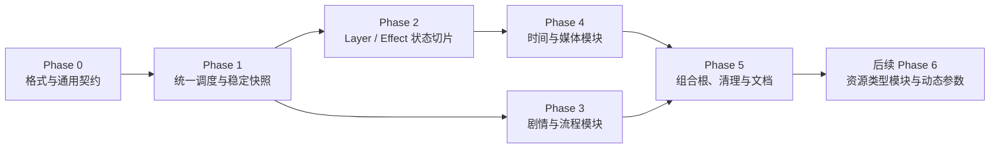

# 原语模块化运行时：分阶段实施计划

> 状态：in-progress。依据 [原语模块化运行时设计](primitive-module-runtime-design.md)。这是跨 Runtime、Core、编辑器与宿主的实施计划；只有标为“已完成”且附有验证证据的工作项可视为已交付。

## 1. 已确认边界

- 不兼容旧原语 ID、字符串句柄、`.galgroup` 和存档；新格式一次切换，旧数据直接拒绝。
- Core 只拥有通用原语、Descriptor、句柄、快照和执行契约；具体原语由模块提供 Handler 与 Descriptor。
- Handler 返回本次调用已解析的执行 Policy；Runtime 只创建、等待、跳过和观察 Operation。
- Save 只写 `LastStableSnapshot`；恢复只重建 Runtime 数据和 Handle，不执行原语或主动驱动 Avalonia 呈现。
- Layer 持久化 Effect GUID；渲染时查询 `HandleManager`，不维护第二份 Effect 目标关系。

每个 Phase 合入时都保持新格式的测试通过；未实现模块可缺席，但不得添加旧格式读取、旧 ID 别名、字符串句柄适配层或旧执行入口。

## 2. Phase 0：格式与通用契约

**状态：in-progress**

**目标：** 建立不依赖具体宿主的原语数据模型、动态模块注册目录和 GUID 内容格式。推荐模块仅是外层可选实现，Core/Runtime 不要求任何具体原语存在。

**前置条件：** 本计划和设计稿已评审；通用原语契约置于 `GalNet.Core`，且依赖图无 Core/Runtime → Avalonia 反向引用。

**涉及模块：** `GalNet.Core`、`GalNet.Runtime`、`GalNet.Presentation.Abstractions`、`GalNet.Editor.Shared`、`GalNet.Editor`、`GeneralTest`。

**工作项：**

**本大步骤已完成（2026-09-22）：** Core 已提供通用 primitive 契约、执行控制和 GUID `HandleManager`；`.galgroup`、快照与存档统一为 v2 JSON primitive envelope，旧版本直接拒绝。`IPrimitiveModule` 的内部 command + descriptor 表是唯一注册事实，`CompositeGameView` 只按完整 ID 动态路由模块；空 profile 与自定义 profile 都有效。`IGameView` 仅保留 descriptor 查询与通用 `Dispatch`。旧专用 View 接口、Runtime Handler/Registry、全局 `PrimitiveCatalog` 和 Runtime 对 Builtins 的引用均已删除。Samples 与编辑器预览暂以空模块集合运行，直到各平台模块在后续 Phase 注册。

**剩余工作：**

**剩余工作：**

1. 将具体原语 schema 从 Core 静态 `EntryRegistry` 移出，并使编辑器的 Builtins 调用点改为组合期注入的 target profile。`TargetProfileEntryCatalog` 已能由模块 descriptor 建立 profile 专属的作者/编译目录；下一步是接通实际编辑器组合根。
2. 统一 GUID 的编辑器生成、JSON 表示和 Runtime 校验，并删除字符串句柄的新增入口。

**验证：**

- Core 测试覆盖新格式读写、原始 JSON 类型保留、GUID 格式、Descriptor 参数默认值/约束、空模块集合、重复注册拒绝，以及 `IGameView` 没有领域方法。
- 编译器/编辑器测试覆盖 target profile 只暴露已挂载模块的 descriptor、开发者自定义 primitive、NonPrimitive 只输出通用 PrimitiveEntry，以及未知/旧格式被拒绝。
- 运行 `dotnet test test/GeneralTest/GeneralTest.csproj`。

**文档：** 更新 `docs/spec/entry-types.md` 和文件格式说明，使其只列新点分隔 ID 与 GUID 字段。

**风险：** `EntryRegistry` 目前同时服务编译、加载、编辑器命令和测试；本 Phase 只能替换其“具体原语”职责，不应误删非原语编译能力。

**退出条件：** 新内容能由指定 target profile 的模块 descriptor 编译、加载并校验；空 profile 和自定义 profile 都可用；`IGameView` 是纯动态分发入口；Core 不含具体原语 Handler、schema、Handler factory Catalog 或隐式推荐能力；推荐 Builtins/抽象模块不形成引擎旁路。

**本轮验证（2026-09-22）：** `dotnet test test/GeneralTest/GeneralTest.csproj --no-restore --disable-build-servers -p:BuildInParallel=false -v minimal` 通过 197/197。静态搜索确认 `src` 与 `test` 中不存在旧专用 View 接口、`EntryHandlerRegistry`、`EntryHandler`、`EntryContext` 或 `PrimitiveCatalog`。

## 3. Phase 1：统一调度、Operation 与稳定快照

**状态：in-progress**

**目标：** 让 `GameEngine` 只通过 `IGameView.Dispatch` 执行通用原语，并由 Runtime 统一决定阻塞、跳过、失败处理和可保存状态。

**前置条件：** Phase 0 的通用 PrimitiveEntry、Descriptor 目录和契约已可用。

**涉及模块：** 契约所在程序集、`GalNet.Runtime`、`GalNet.Presentation.Defaults`、`GeneralTest`。

**工作项：**

**已完成：** `OperationManager` 跟踪已接受调用的 Sequence、批次和完成回收；`GameEngine` 的普通 Group 与内部 Choice 均以 `PrimitiveInvocation` 经 `IGameView.Dispatch` 执行，Descriptor 决定 Checkpoint。`CreateSaveData` 使用最近稳定快照，`RestoreFrom` 只恢复 Runtime 数据。旧 Handler 路径与专用呈现端口均不存在。

**剩余工作：**

1. 将预期内容/宿主失败转为诊断和 `PrimitiveResult.Failed`；未注册或参数不合法的调用安全跳过；仅 Scope 取消向上传播。
2. 用测试模块覆盖时间轴事件的相同 Dispatch 入口且不创建 Checkpoint，并将内置模块接入各宿主。

**验证：**

- 单元测试覆盖模块/命令重复注册、未知原语、有效 Policy、阻塞与非阻塞推进、跨模块跳过合批、预期失败继续、取消和非阻塞异常观察。
- 集成测试覆盖 Checkpoint 只来自稳定状态，Save 始终返回最近稳定快照。
- 运行 `dotnet test test/GeneralTest/GeneralTest.csproj`。

**文档：** 更新 `docs/spec/runtime.md` 的执行流程和存档描述。

**风险：** 此 Phase 不应依赖 Avalonia；先以 Null/测试模块证明调度正确，避免把 UI 生命周期问题带入 Engine。

**退出条件：** 测试模块可完整证明路由、跳过和稳定快照语义。

## 4. Phase 2：Layer、Effect 与纯数据恢复

**状态：planned**

**目标：** 以最小可见场景切片验证 GUID Handle、Layer → Effect 关联、渲染时查询和无顺序恢复。

**前置条件：** Phase 1 的 Dispatcher、OperationManager 和稳定快照可用。

**涉及模块：** `GalNet.Core`、`GalNet.Runtime`、`GalNet.Avalonia.Rendering`、`GalNet.Avalonia.GameView`、`GalNet.Presentation.Defaults`、`GeneralTest`。

**工作项：**

1. 用 `HandleManager` 替换 `ISceneInstanceManager` 的字符串键路径；将 Layer 和 Effect 的持久化 ID 切为编辑器生成 GUID。
2. 实现 `layer.*` 与 `effect.apply/set/remove` 模块及 Descriptor；`effect.apply` 注册 Effect 后写入 Layer 的 Effect ID 列表，`remove` 反向清理后释放 Handle。
3. 将 Avalonia 渲染改为从 Layer 的有序 Effect ID 列表查询 `HandleManager`；Effect 平台缓存按 Handle/参数失效，绝不进入快照，也不保存目标 Layer 或目标顺序。
4. 将 `LastStableSnapshot` 做成深拷贝数据边界：每一步位置更新后及非阻塞 Operation 结束后，仅在稳定时替换。用干净 Scope 上的纯数据重建替换 `GameRuntime.RestoreFrom` 的原语或直接 View 重放；恢复必须在同一调度线程或经原子状态替换完成。
5. 删除 Layer/Effect 的字符串句柄和重复目标关系；悬挂 Effect ID 在恢复时诊断并清理。

**验证：**

- Core/Runtime 测试覆盖 GUID 句柄、重复拒绝、Effect 附着/移除、全局 Effect、悬挂引用清理和任意顺序快照重建。
- Avalonia 渲染测试覆盖 Layer 按 ID 查询 Effect，且恢复过程不产生 Dispatch、Operation 或 UI 命令。
- 使用新格式 Sample 内容完成 Layer + Effect 冒烟运行。

**文档：** 更新场景、Effect 与存档 spec；移除“Effect 保存目标 Layer ID”及“恢复按类型重放 View”的旧描述。

**风险：** 同一关系不得同时由 Layer 和 Effect 持久化；只允许 Layer 的 Effect ID 列表成为目标关联权威。

**退出条件：** Layer 和 Effect 在新格式 Sample 中可创建、修改、删除、存档并无顺序恢复；Avalonia 下一帧按恢复状态渲染正确结果。

## 5. Phase 3：剧情、流程与交互模块

**状态：planned**

**目标：** 迁移驱动故事推进的文字、选择、等待和变量原语，并使 Checkpoint/内部交互完全经过统一调度。

**前置条件：** Phase 1 完成；Phase 2 不要求完成，但其稳定快照语义必须可复用。

**涉及模块：** `GalNet.Runtime`、契约所在程序集、`GalNet.Avalonia.GameView`、`GalNet.Presentation.Defaults`、`GalNet.Editor`、`GeneralTest`。

**工作项：**

1. 实现 `dialogue.text`、对话显示/隐藏、`interaction.choice`、`flow.wait`、`variable.set` 与画廊解锁模块；去除无前缀旧原语。
2. 将 `ProcessChoiceBranchAsync` 改为等待 `interaction.choice` 的 `PrimitiveResult.Value`，不再调用专用 Interaction View 接口。
3. 让文本和选择的 Checkpoint 使用 Phase 1 的稳定快照规则；Choice 的内部 Invocation 不写入 `.galgroup`。
4. 更新编辑器 palette、快捷命令和验证，使其只显示 Descriptor 目录中当前配置的原语。

**验证：**

- Engine 集成测试覆盖文字、条件、选择分支、等待、变量、取消、交互返回值和稳定 Checkpoint。
- Null 模块与 Avalonia 模块都覆盖一次完整新格式剧情流程。

**文档：** 更新 `entry-types.md`、`runtime.md` 和编辑器作者说明中的原语名称、参数与 Checkpoint 语义。

**风险：** 内部交互的结果类型必须经 Descriptor/Result 明确约束，不能重新暴露专用 View 旁路。

**退出条件：** 一段含文本、选择、等待和变量的新格式剧情可在 Headless、Sample 与编辑器预览中运行，且不依赖旧专用交互接口。

## 6. Phase 4：动画、粒子、音视频与剩余模块

**状态：planned**

**目标：** 把所有长生命周期和媒体行为迁入模块体系，彻底收回呈现层的跳过批次和 Runtime 旁路。

**前置条件：** Phase 1 完成；Phase 2 的 GUID Handle 机制可供动画、粒子和 Effect 使用。

**涉及模块：** `GalNet.Runtime`、`GalNet.Avalonia.GameView`、`GalNet.Avalonia.Rendering`、`GalNet.Presentation.Defaults`、Samples、Editor Preview、`GeneralTest`。

**工作项：**

1. 迁移 `animation.animate/play/stop`、时间轴事件与播放 Handle；时间轴事件始终走 `IGameView.Dispatch + OperationManager`。
2. 迁移 particle、audio、video 和其余控制类原语为模块；需要可寻址生命周期的对象改用 GUID Handle。
3. 模块化时删除 Avalonia 页面中遗留的活动动画表和 `SkipAnimationBatch`；宿主只执行单次调用、响应该调用的 `SkipRequested`，不再决定剧情推进或批次。
4. 为循环、不可跳过和非阻塞 Operation 明确 Handler 强制 Policy；所有影响持久化状态的异步结束后才允许后续稳定快照。

**验证：**

- 测试同批跨模块动画/Effect 跳过、默认单独批次、跳过幂等、时间轴事件诊断和非阻塞失败回收。
- 覆盖粒子、循环动画和媒体的 Handle 清理、Scope 取消和纯数据恢复。
- Sample 与 Editor Preview 的长时间运行冒烟测试，不保留完成的 Operation。

**文档：** 更新原语目录、动画/粒子/媒体行为和性能约束；删除呈现层拥有跳过批次的说明。

**风险：** 不要将宿主内部线程模型泄漏到 Core；只要求宿主对单次调用的 Cancellation/Skip 契约负责。

**退出条件：** 所有内置原语均以模块执行；不存在 HandlerRegistry、专用 View 路由或呈现端跳过批次旁路。

## 7. Phase 5：组合根、清理与正式验证

**状态：planned**

**目标：** 让各宿主、编辑器和测试只使用新模块组合方式，并删除旧架构及不兼容格式的残留。

**前置条件：** Phase 2–4 完成，所有内置原语已迁移。

**涉及模块：** 全部 Runtime、Core、Presentation、Avalonia、Sample、Editor、Storage 和测试项目。

**工作项：**

1. 更新 Sample Headless、Sample Avalonia、Editor Preview、`DefaultGameSession` 和组合根，按 Game Scope 创建模块、HandleManager 与 OperationManager。
2. 静态确认没有重新引入旧 View/Handler 路径、旧字符串句柄/快照字段或旧内容格式读取路径。
3. 重写 Sample、测试夹具和编辑器模板为新点分隔 ID 与 GUID；旧格式测试改为断言明确拒绝。
4. 同步 `architecture.md`、`runtime.md`、`entry-types.md`、场景/存档/效果说明和本设计的实施状态；记录实际偏差与验证结果。

**验证：**

- `dotnet test GalNet.slnx`。
- 构建 Headless Sample、Avalonia Sample、Editor 和 Editor.Headless；以新格式内容完成加载、流程、跳过、存档、关闭、恢复的端到端冒烟。
- 静态搜索确认不存在 `EntryHandlerRegistry`、旧专用 View 接口、旧无前缀原语定义或字符串 Handle 新增路径。

**文档：** 将已实现事实从 design 同步到对应 `docs/spec/`；设计稿仅保留目标和已验证的迁移结论。

**风险：** 这是有意破坏性切换。发行说明必须明确旧项目和旧存档不可读取，避免任何“自动修复”暗中形成兼容层。

**退出条件：** 新架构是唯一执行与内容路径；所有宿主通过新模块组合运行，完整测试和端到端冒烟通过，旧架构代码已删除。

## 8. 后续 Phase 6：资源类型模块与动态参数目录

**状态：planned（未开始，不阻塞当前原语模块化阶段）**

**目标：** 让资源类型与 primitive 一样在宿主组合期动态注册；每个资源类型模块拥有冻结的参数 schema 和加载实现，资源系统按稳定字符串 `typeId` 查找模块。

**前置条件：** 当前 Phase 0–5 的原语模块化已完成并完成正式验证；资源格式的破坏性切换范围已单独确认。

**涉及模块：** `GalNet.Core`、`GalNet.Storage.Abstractions`、`GalNet.Assets`、资源 Provider/Archive、`GalNet.Editor`、平台资源模块、资源测试。

**工作项：**

1. 定义通用、只读的 `DynamicParameterTable` 与 descriptor；参数包含类型 ID、必填性、默认 JSON 值和约束，并让 primitive descriptor 与资源 metadata schema 复用它。
2. 定义 `IResourceModule` 和 `CompositeResourceCatalog`；一个稳定 `typeId` 对应一个模块，组合根冻结路由并拒绝重复注册。
3. 让 `AssetManager` 通过资源目录解析 metadata 的 `typeId`；迁移现有 `ResourceType`、硬编码字符串映射和 CLR 类型 decoder 表，资源 metadata 改为 `typeId + parameters` JSON。
4. 更新 Provider、Archive、缓存键和编辑器资源筛选/校验；内置资源类型成为可选模块，支持仅挂载自定义模块的 profile。

**验证：**

- 单元测试覆盖空 catalog、重复 type ID 拒绝、自定义资源模块、冻结参数表、未知类型和参数错误诊断。
- Provider/Archive/AssetManager 测试覆盖按字符串 type ID 路由、缓存和取消语义；不允许回退到 `unknown` 或隐式内置类型。
- 编辑器测试确认资源列表与参数校验只来自当前 target profile 的模块 schema；本 Phase 不要求动态生成编辑控件。

**文档：** 将已验证的格式与 API 事实同步至 `docs/spec/assets.md`；当前 spec 在实现前不得宣称资源类型已经动态化。

**风险：** 资源 metadata、pak 索引、缓存键与 decoder 路径必须作为一次破坏性切换处理；不得为旧 `ResourceType` 或类型别名保留双读、双写或回退逻辑。

**退出条件：** 宿主可只注册自定义资源模块并以其字符串 `typeId` 加载、校验和缓存资源；Core/AssetManager 不含资源类型枚举、静态映射或隐式内置资源能力；动态参数 schema 可同时服务 primitive 和资源 metadata。

## 9. 实施纪律

- 每个 Phase 开始前确认前序退出条件，而非依赖未验证的局部重构。
- 每个 Phase 完成后记录实际变更、验证命令和已知偏差；若设计改变，先修订设计稿和本计划，再推进后续 Phase。
- 不为过渡便利增加兼容读取、别名、双写快照或双注册表；这会直接违反已确认边界。
