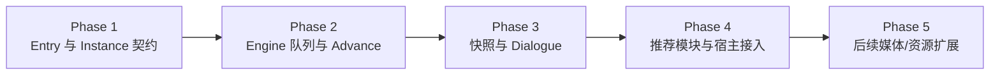

# Entry Module 与 PrimitiveInstance 运行时：分阶段计划

> 状态：当前 Entry Module + PrimitiveInstance 主路径已实现。本文保留跨 feature 的长期迁移边界，具体本轮实现记录见 `features/F-20260922-01-entry-instance-runtime/`。

## 已确认边界

- 不保留旧 Handler、Descriptor、OperationManager、ExecutionControl 或 Result 模型。
- Core/Runtime 不引用 Avalonia 或其他平台实现。
- Runtime 只执行编译后的 `PrimitiveEntry`；Composite 仅供 authoring/编译。
- GameView 只分发单条 primitive；活动队列、Batch skip、Choice、节点跳转和快照由 Engine 管理。
- 对玩家只暴露 `GameEngine.AdvanceAsync`。
- 快照由 Engine 在稳定边界统一更新，不由 primitive 元数据决定。
- 影响存档事实的 non-blocking primitive 必须在 `Dispatch()` 返回前提交最终逻辑状态。

## Phase 1：Entry 与 Instance 契约

**状态：verified**

已完成：

- `EntryBase`、`PrimitiveEntryBase`、`DefaultPrimitiveEntryBase`、`CompositeEntryBase`、`DefaultCompositeEntryBase` 和 `PrimitiveInstance`。
- `IEntryModule` 的 `PrimitiveEntries` / `CompositeEntries` 两张冻结表。
- `DynamicParameterTable` 作为唯一参数 schema 来源。
- `PrimitiveCreateContext` 暴露 definition、entry、runtime、scope cancellation、parameters、arguments 和 BatchId。
- `PrimitiveEntry` / `PrimitiveEntryDocument` 持有通用 `BatchId`。
- 旧 Handler/Descriptor/ExecutionControl 契约从代码路径移除。

验证：

- 模块冻结、重复项、默认工厂、共享参数 helper、工厂上下文字段、BatchId 原样传递和实例单次 dispatch 测试。

## Phase 2：Engine 队列与 Advance 调度

**状态：verified**

已完成：

- `CompositeGameView` 只解析并 dispatch 一条 primitive，不保存活动队列。
- `GameEngine` 拥有活动 instance 队列、sequence 和 group execution id。
- `AdvanceAsync` 按最早 blocking batch 选择 skip 候选。
- 同 group 同 batch 的已分发 non-blocking/skippable instance 会一起收到 skip。
- Blocking 自然完成触发无 skip 权限的内部 continue。
- Choice、条件、edge 映射和节点跳转由 Engine 内置处理。
- `CreateSaveData()` 返回最后稳定快照。

验证：

- 局部 batch、跨 group 同名 batch 隔离、不可跳过 blocker、自然完成、Choice 可见索引、未知 primitive 安全跳过、non-blocking 快照边界等测试。

## Phase 3：快照边界与 Dialogue `\skip`

**状态：verified**

已完成：

- 稳定快照条件改为“无未完成 blocking instance 且无 pending Choice”，不要求活动队列为空。
- 普通文本和富文本共享反斜杠指令识别。
- `dialogue.text` 使用 `DialoguePrimitiveInstance` 管理 Typing 与 WaitingAdvance。
- `\skip` 每次 Advance 至多跨一个边界；全文显示后下一次 Advance 才完成对话。
- Avalonia 和 Headless 对话路径迁移到新 presenter 端口。

验证：

- 普通/富文本解析、转义、连续 skip、自然完成等待、Advance 完成语义和稳定快照测试。

## Phase 4：推荐模块与宿主接入

**状态：partially verified**

已完成：

- `layer.*`：更新 runtime `SceneState`，再通知 `ILayerPresenter`。
- `animation.animate`：创建 `AnimationPrimitiveInstance`，先提交最终逻辑状态，再调用 `IAnimationPresenter`。
- `animation.play`：一个 plan 对应一个 `AnimationPlanPrimitiveInstance`；内部 layer/effect 事件作为 animation 模块私有事件处理，不重新进入通用 Entry 分发。
- `animation.stop`：请求已保存的播放句柄停止，`CompleteImmediately` 可要求 presenter 立即完成。
- `effect.apply` / `effect.stop`：维护 `ActiveEffects`、目标 Layer 的 effect id 列表和 `IEffectPresenter`。
- `flow.wait`：blocking、skippable 的等待 instance。
- `variable.set`：求值后写入 Runtime 变量。
- Avalonia Sample、Editor Preview 和 Headless Sample 的组合根已传入 animation/effect presenter。
- Avalonia 页面级 `SkipAnimationBatch` 已移除；批次由 Engine 管理。

验证：

- `dotnet build test/GeneralTest/GeneralTest.csproj --no-restore -m:1 -v:minimal -p:UseSharedCompilation=false`，需设置 `AVALONIA_TELEMETRY_OPTOUT=1`。
- `dotnet test test/GeneralTest/GeneralTest.csproj --no-restore -m:1 -v:minimal -p:UseSharedCompilation=false`：219/219 通过（2026-09-22）。
- 新增测试覆盖 animation/effect runtime state、presenter 调用、plan final state 和 `flow.wait` skip。

仍未完成：

- 音频、视频、粒子和画廊只保留推荐 schema，完整产品行为留给后续 feature。
- Animation timeline 内部事件目前是模块私有 layer/effect 事件；更完整的 authoring 事件能力需要单独设计。
- 资源类型模块化仍是独立后续工作。

## Phase 5：后续扩展

**状态：planned**

后续 feature 可在当前模型上继续推进：

- 完整音频系统与媒体模块。
- 粒子模块与粒子状态恢复。
- 画廊解锁与进度服务整合。
- 资源类型模块化和资源 metadata 动态参数 schema。
- 更完整的 animation authoring、timeline event 校验和平台优化。

## 实施纪律

- 每个 Phase 完成后记录验证命令和已知偏差。
- 正式 `docs/spec/` 只写当前已经实现的事实。
- `docs/design/` 可以记录路线，但不得要求恢复旧 Handler/Operation 模型。
- 不为过渡便利增加兼容读取、旧 ID 别名、双写快照或双注册表。
