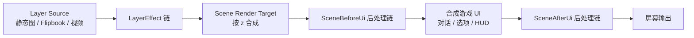

# 分阶段渲染与可扩展 Effect 管线计划

## 目标

将当前以 Avalonia 控件直接合成 Layer 的呈现方式，演进为可处理动态源和 GPU 像素效果的渲染管线。新设计必须支持：

- 单个 Layer 串联局部效果；
- 静态图片、Flipbook 和未来视频等动态 Layer 源；
- 场景合成后、游戏 UI 合成前的全屏后处理；
- UI 合成后、输出到屏幕前的最终后处理；
- 每个具体效果由自己的模块负责，不在场景宿主中加入按 effect ID 分支；
- 保持 Core / Runtime 不依赖 Avalonia、Skia 或 GPU 类型。

## 渲染阶段



| 阶段 | 输入 | 典型效果 | 是否影响游戏 UI |
| --- | --- | --- | --- |
| `Layer` | 一个 Layer 的当前帧 | 调色、溶解、局部发光、扭曲 | 否 |
| `SceneBeforeUi` | 已合成的场景纹理 | LUT、暗角、bloom、景深 | 否 |
| `SceneAfterUi` | 场景与游戏 UI 的合成纹理 | 闪白、全屏淡出、故障 | 是 |
| `Overlay` | 无纹理输入，独立绘制 | 粒子、装饰控件 | 由 Overlay 的层级决定 |

同一阶段的 effect 必须按显式 `order` 升序稳定执行；相同 `order` 时按添加顺序执行。效果顺序是作者可见的数据，因为调色和 bloom 的顺序会改变结果。

## 边界与核心抽象

### Layer source

`Layer` 持有 `ILayerSource`，不再直接假定资产一定是一张静态图片。渲染端的 source 每帧产出当前输入纹理；effect 只处理该纹理，不知道 source 的类型。

```csharp
interface ILayerSource
{
    TextureHandle GetFrame(in RenderFrameContext frame);
}
```

- `StaticImageSource`：返回同一纹理；保留现有 `assetId` 作为兼容的 authoring 简写。
- `FlipbookSource`：由帧列表、FPS、起始偏移和循环模式决定当前纹理。
- `VideoSource`：以后由解码器提供当前帧，不改变 effect 接口。

`TextureHandle`、`RenderFrameContext` 和 GPU 命令上下文都属于 Avalonia/渲染实现程序集；Core 中只保留 source 的可序列化描述、effect 定义和参数 schema。

### 像素 effect

局部和全屏的 Shader 效果共享“输入纹理到输出纹理”的执行模型。具体效果独立声明元数据、参数、可动画属性、资源需求和渲染实现。

```csharp
interface IImageEffect
{
    EffectDefinition Definition { get; }
    TextureHandle Render(TextureHandle input, in EffectRenderContext context);
}
```

`EffectRenderContext` 提供当前时间、尺寸、动画参数、辅助输入（mask/LUT/noise）及受控的临时纹理申请接口。Effect 不直接访问其他 Layer、页面 ViewModel 或全局状态。

### 非像素 effect

并非每个效果都应被强制离屏渲染。

- 规则几何裁剪（如百叶窗）可继续使用 Clip/Geometry，以避免无意义的纹理分配；
- 粒子和其他独立视觉对象继续作为 `Overlay` effect；
- 纹理 mask、溶解和边缘燃烧由具体 `IImageEffect` 以辅助输入实现。

因此不单独设通用 `MaskEffect` 运行时类别。Mask 是 effect 的一种输入；只有纯几何裁剪保留为专用的轻量实现。

## 数据模型与兼容策略

现有 `EffectScope.Overlay / Layer` 逐步演进为阶段语义，建议在兼容窗口内保留旧字段的反序列化支持：

```csharp
enum EffectStage { Layer, SceneBeforeUi, SceneAfterUi, Overlay }
```

- `Layer` 阶段必须有 `targetHandleId`。
- 两个 Scene 阶段不得指定 `targetHandleId`。
- `Overlay` 不要求输入纹理；其视觉层级由 effect 定义固定，避免内容作者用参数绕过 UI 层次。
- `EffectDefinition` 继续是编辑器下拉、参数检查和动画属性提示的唯一元数据来源。
- `EffectInstance` 继续保存静态参数和已提交动画值；新增 `stage`、`order` 等字段时，同步更新快照、恢复、导出和兼容测试。

Layer source 的 authoring 数据优先采用显式 `source` 对象；旧 `assetId` 加载时映射为 `StaticImageSource`，导出时可按兼容版本选择保留简写或写出对象。

## 实施阶段

### Phase 1：渲染抽象与数据契约

- 定义 `EffectStage`、阶段验证规则及稳定排序规则。
- 为 Layer 引入可序列化的 source 描述；实现旧 `assetId` 到静态 source 的兼容映射。
- 将 effect factory 的元数据从旧 Scope 扩展到 Stage，编辑器展示阶段、参数和可动画属性。
- 不改变现有 `mask.blinds`、粒子和静态 Layer 的视觉行为。

验收：旧游戏内容、存档恢复和编辑器 effect 参数提示保持可用；非法目标/阶段组合能显示诊断。

### Phase 2：离屏场景与 effect render graph

- 建立渲染后端专属的 `RenderGraph` / `EffectRenderer`，管理 source、临时纹理、Layer effect 链和场景 render target。
- 将 `SceneLayerHost` 收缩为最终画面承载与输入布局宿主，不承担具体 effect 分支。
- 实现 ping-pong 临时纹理池，确保每个 effect 不持有上一帧临时输出。
- 定义资源失效、窗口缩放、设备重建和 effect 停止时的释放策略。

验收：两种无副作用的测试 Shader 可串联到同一 Layer；SceneBeforeUi 与 SceneAfterUi 各能改变正确的画面范围。

### Phase 3：首批 Shader 效果

- `layer.colorGrade`：亮度、对比度、饱和度、色相或简单 LUT。
- `layer.dissolve`：原图、mask、`progress`、边缘宽度和边缘色。
- `layer.glow`：阈值、颜色、半径和强度。
- `scene.vignette` 与 `scene.colorGrade`：验证全屏场景后处理。
- `scene.flash`：作为 `SceneAfterUi` 的最小验证效果。

验收：每种 effect 只有自身 factory/Shader/参数解析模块知晓其参数；动画计划可驱动 `progress`、`intensity` 等属性并在存档恢复后保持状态。

### Phase 4：Flipbook source

- 实现 `FlipbookSource`：帧列表、FPS、循环模式、起始时间偏移与可选暂停。
- 使用统一 `RenderFrameContext.Time` 取帧，避免 source 自行启动计时器。
- 明确动态 source 的缓存规则：可缓存 source 纹理和不依赖时间的辅助资源，不能缓存动态帧经过 effect 后的最终输出。
- 在动态 source 上验证溶解、调色和发光。

验收：flipbook 在 Layer effect 运行和参数动画期间持续正常播放；暂停、恢复和存档行为有确定规则并经测试覆盖。

### Phase 5：性能、降级与创作体验

- 限制可配置的渲染分辨率、effect 数量和纹理池预算；记录帧耗时与纹理分配诊断。
- 无 Shader / GPU 后端时，明确每个 effect 的降级策略：近似控件实现、跳过并记录诊断，或阻止执行。
- 在编辑器中提供 effect 排序、阶段选择、参数表单、资源选择和小型预览。
- 为常用组合提供预设，避免作者手写 JSON。

验收：效果失败不会破坏场景渲染；资源不足或不支持时有可理解的编辑器与运行时诊断。

## 测试策略

- Core/Runtime：阶段、目标、排序、序列化、旧内容和快照恢复的纯逻辑测试。
- 渲染后端：固定输入纹理的像素/快照测试，验证局部效果与两个全屏阶段的范围。
- 动态 source：使用可预测时钟验证 Flipbook 取帧、循环、暂停和 effect 链输入。
- 集成：Sample 中分别展示人物 dissolve、场景 LUT/暗角、对话框不受影响，以及全屏闪白同时影响 UI。
- 性能：多 Layer、多 effect、长时 Flipbook 的纹理池复用与分配计数测试。

## 非目标

- 不在 Core 或 Runtime 中引入 Avalonia、Skia、Shader 字节码或 GPU 资源。
- 不把每个 effect 的参数写入 `SceneLayerHost` 或 ViewModel 的专用字段。
- 不将所有视觉对象强制转换为像素 effect；粒子、几何裁剪等应继续走更轻的实现路径。
- 不让内容作者以任意参数改变 UI 前后层级；阶段属于 effect 定义和受验证的实例数据。

