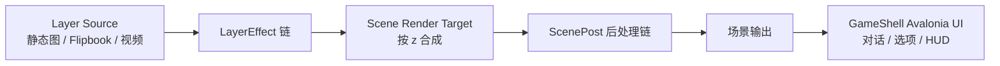

# 分阶段渲染与可扩展 Effect 管线计划

## 目标

将当前以 Avalonia 控件直接合成 Layer 的呈现方式，演进为可处理动态源和 GPU 像素效果的渲染管线。新设计必须支持：

- 单个 Layer 串联局部效果；
- 静态图片、Flipbook 和未来视频等动态 Layer 源；
- 场景合成后、游戏 UI 合成前的全屏后处理；
- 每个具体效果由自己的模块负责，不在场景宿主中加入按 effect ID 分支；
- 保持 Core / Runtime 不依赖 Avalonia、Skia 或 GPU 类型。

## 渲染阶段



| 阶段 | 输入 | 典型效果 | 是否影响游戏 UI |
| --- | --- | --- | --- |
| `Layer` | 一个 Layer 的当前帧 | 调色、溶解、局部发光、扭曲 | 否 |
| `ScenePost` | 已合成的场景纹理 | LUT、暗角、bloom、景深、场景闪白 | 否 |
所有阶段都使用同一个纹理流接口：取上一个 pass 的输出纹理，写出下一张纹理。`ScenePost` 是 Layer 全部完成并合成后唯一的全局后处理插槽。

同一阶段的 effect 必须按显式 `order` 升序稳定执行；相同 `order` 时按添加顺序执行。效果顺序是作者可见的数据，因为调色和 bloom 的顺序会改变结果。

## 边界与核心抽象

### Layer source

`Layer` 持有 `ILayerSource`，不再直接假定资产一定是一张静态图片。渲染端的 source 每帧产出当前输入纹理；effect 只处理该纹理，不知道 source 的类型。

```csharp
interface ILayerSource
{
    TextureHandle GetFrame(in RenderFrameContext frame);
}
```

- `StaticImageSource`：返回同一纹理；保留现有 `assetId` 作为兼容的 authoring 简写。
- `FlipbookSource`：由帧列表、FPS、起始偏移和循环模式决定当前纹理。
- `VideoSource`：以后由解码器提供当前帧，不改变 effect 接口。

`TextureHandle`、`RenderFrameContext` 和 GPU 命令上下文都属于 Avalonia/渲染实现程序集；Core 中只保留 source 的可序列化描述、effect 定义和参数 schema。

### 像素 effect

局部和全屏的 Shader 效果共享“输入纹理到输出纹理”的执行模型。具体效果独立声明元数据、参数、可动画属性、资源需求和渲染实现。

```csharp
interface IImageEffect
{
    EffectDefinition Definition { get; }
    TextureHandle Render(TextureHandle input, in EffectRenderContext context);
}
```

`EffectRenderContext` 提供当前时间、尺寸、动画参数、辅助输入（mask/LUT/noise）及受控的临时纹理申请接口。Effect 不直接访问其他 Layer、页面 ViewModel 或全局状态。

### Scene object

粒子不是“处理一张已有纹理”的 effect，而是独立更新并参与场景合成的渲染对象。它与 Layer 使用同一个 GPU 场景目标、坐标系和排序规则，但不进入 `IImageEffect`。

```csharp
interface ISceneRenderable
{
    int Order { get; }
    void Update(in RenderFrameContext frame);
    void Render(in SceneRenderContext context);
}
```

`ParticleEmitter` 实现此接口：负责粒子出生、生命周期和运动状态；渲染端将存活粒子批量提交为 sprite/quad instance。雨、雪、花瓣、火星等也复用这一类场景对象能力。

### 固定像素管线

effect 管线只接受 `Texture → Texture` 的像素 effect；粒子、独立控件和几何裁剪不属于该管线。纹理 mask、溶解和边缘燃烧由具体 `IImageEffect` 以辅助输入实现，不单独设 `MaskEffect` 运行时类别。

现有 `particle.emitter` 和 `mask.blinds` 是离屏渲染后端落地前的 Avalonia 视觉实现。进入 Phase 2 时，前者迁为 `ISceneRenderable`，后者改为 shader mask；不为它们保留第二条 Avalonia 视觉分支。

## 数据模型

直接使用阶段语义，不保留 `EffectScope` 或旧内容兼容层：

```csharp
enum EffectStage { Layer, ScenePost }
```

- `Layer` 阶段必须有 `targetHandleId`。
- `ScenePost` 不得指定 `targetHandleId`。
- 所有阶段都由同一个 `IImageEffect.Render(input, context)` 执行契约处理；阶段只决定 input 是单个 Layer 还是已合成场景。
- `EffectDefinition` 继续是编辑器下拉、参数检查和动画属性提示的唯一元数据来源。
- `EffectInstance` 继续保存静态参数和已提交动画值；新增 `stage`、`order` 等字段时，同步更新快照、恢复、导出和测试。

Layer source 的 authoring 数据优先采用显式 `source` 对象；现阶段 `assetId` 与可选 `flipbook` 已足够表示静态图和精灵表，后续再统一写入 `source` 对象。

## 实施阶段

### Phase 1：渲染抽象与数据契约（已完成）

已完成：定义 `EffectStage`，将 factory 元数据与编辑器提示切换到 Stage；`Layer` stage 强制要求目标 Layer，`ScenePost` 禁止目标 Layer；effect 实例及存档状态保存同阶段的 `order`。Layer 的 source 已抽出当前帧选择，静态图与 Flipbook 使用同一路径。

验收：非法目标/阶段组合能显示诊断；Layer、Effect 和快照测试覆盖配置及恢复。

### Phase 2：离屏场景与 effect render graph（进行中）

- 已完成首个切片：`SceneLayerHost` 已从每 Layer 一个 Avalonia 子控件收缩为单一绘制面，并公开稳定的 `SceneRenderPlan`（`z`、再按插入顺序）。
- 建立渲染后端专属的 `RenderGraph` / `EffectRenderer`，管理 source、临时纹理、Layer effect 链和场景 render target。
- 建立 `SceneRenderer` 的 renderable 收集与排序入口；Layer 与 `ISceneRenderable` 一起写入同一个场景 render target。
- 将 `SceneLayerHost` 收缩为最终画面承载与输入布局宿主，不承担具体 effect 分支。
- 实现 ping-pong 临时纹理池，确保每个 effect 不持有上一帧临时输出。
- 定义资源失效、窗口缩放、设备重建和 effect 停止时的释放策略。

验收：两种无副作用的测试 Shader 可串联到同一 Layer；一个测试 renderable 可与 Layer 按 order 合成；ScenePost 能改变合成场景而不影响 GameShell UI。

### Phase 3：首批 Shader 效果

- `layer.colorGrade`：亮度、对比度、饱和度、色相或简单 LUT。
- `layer.dissolve`：原图、mask、`progress`、边缘宽度和边缘色。
- `layer.glow`：阈值、颜色、半径和强度。
- `scene.vignette` 与 `scene.colorGrade`：验证全屏场景后处理。
- `scene.flash`：作为 `ScenePost` 的最小验证效果。

验收：每种 effect 只有自身 factory/Shader/参数解析模块知晓其参数；动画计划可驱动 `progress`、`intensity` 等属性并在存档恢复后保持状态。


### Phase 4：GPU 粒子与其他场景对象

- 将 `particle.emitter` 从 `IEffectView` / Avalonia `Control` 迁为 `ParticleEmitter : ISceneRenderable`。
- 定义粒子 emitter 的 authoring 数据：贴图、发射率、最大数量、初速度、重力、生命周期、尺寸与颜色曲线。
- 采用 instance buffer / 批量 sprite draw 绘制存活粒子；不为每颗粒子创建 Layer、Control 或独立 draw target。
- 保持与 Layer 一致的 `order`、世界/屏幕坐标及场景裁剪语义；明确粒子在 Layer effect 之前或之后的 authoring 规则。

验收：高数量粒子不创建 Avalonia 控件；粒子位于 `ScenePost` 之前且不影响 GameShell UI；停止、存档恢复和资源释放有确定行为。

### Phase 5：性能、降级与创作体验

- 限制可配置的渲染分辨率、effect 数量和纹理池预算；记录帧耗时与纹理分配诊断。
- 无 Shader / GPU 后端时，明确每个 effect 的降级策略：近似控件实现、跳过并记录诊断，或阻止执行。
- 在编辑器中提供 effect 排序、阶段选择、参数表单、资源选择和小型预览。
- 为常用组合提供预设，避免作者手写 JSON。

验收：效果失败不会破坏场景渲染；资源不足或不支持时有可理解的编辑器与运行时诊断。

## 测试策略

- Core/Runtime：阶段、目标、排序、序列化、旧内容和快照恢复的纯逻辑测试。
- 渲染后端：固定输入纹理的像素/快照测试，验证局部效果与唯一 `ScenePost` 的范围。
- 动态 source：使用可预测时钟验证 Flipbook 取帧、循环、暂停和 effect 链输入。
- 集成：Sample 中分别展示人物 dissolve、场景 LUT/暗角和场景闪白；对话框始终不受影响。
- 性能：多 Layer、多 effect、长时 Flipbook 的纹理池复用与分配计数测试。

## 非目标

- 不在 Core 或 Runtime 中引入 Avalonia、Skia、Shader 字节码或 GPU 资源。
- 不把每个 effect 的参数写入 `SceneLayerHost` 或 ViewModel 的专用字段。
- 在 Phase 2 之后不为粒子、几何裁剪等保留第二条 Avalonia 视觉分支；粒子迁为场景对象，几何裁剪改写为像素 effect 或渲染状态。
- 不让内容作者以任意参数改变 UI 前后层级；阶段属于 effect 定义和受验证的实例数据。
