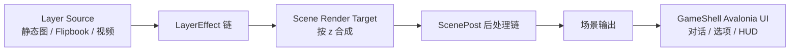

# 分阶段渲染与可扩展 Effect 管线计划

## 目标

将当前以 Avalonia 控件直接合成 Layer 的呈现方式，演进为可处理动态源和 GPU 像素效果的渲染管线。新设计必须支持：

- 单个 Layer 串联局部效果；
- 静态图片、Flipbook 和未来视频等动态 Layer 源；
- 场景合成后、游戏 UI 合成前的全屏后处理；
- 每个具体效果由自己的模块负责，不在场景宿主中加入按 effect ID 分支；
- 保持 Core / Runtime 不依赖 Avalonia、Skia 或 GPU 类型。

## 渲染阶段


```mermaid
flowchart LR
  Source[Layer Source\n静态图 / Flipbook / 视频] --> LE[LayerEffect 链]
  LE --> Scene[Scene Render Target\n按 z 合成]
  Scene --> Post[ScenePost 后处理链]
  Post --> Output[场景输出]
  Output --> UI[GameShell Avalonia UI\n对话 / 选项 / HUD]
```

| 阶段 | 输入 | 典型效果 | 是否影响游戏 UI |
| --- | --- | --- | --- |
| `Layer` | 一个 Layer 的当前帧 | 调色、溶解、局部发光、扭曲 | 否 |
| `ScenePost` | 已合成的场景纹理 | LUT、暗角、bloom、景深、场景闪白 | 否 |
所有阶段都使用同一个纹理流接口：取上一个 pass 的输出纹理，写出下一张纹理。`ScenePost` 是 Layer 全部完成并合成后唯一的全局后处理插槽。

同一阶段的 effect 必须按显式 `order` 升序稳定执行；相同 `order` 时按添加顺序执行。效果顺序是作者可见的数据，因为调色和 bloom 的顺序会改变结果。

## 边界与核心抽象

### Layer source

`Layer` 持有 `ILayerSource`，不再直接假定资产一定是一张静态图片。渲染端的 source 每帧产出当前输入纹理；effect 只处理该纹理，不知道 source 的类型。

```csharp
interface ILayerSource
{
    TextureHandle GetFrame(in RenderFrameContext frame);
}
```

- `StaticImageSource`：返回同一纹理；保留现有 `assetId` 作为兼容的 authoring 简写。
- `FlipbookSource`：由帧列表、FPS、起始偏移和循环模式决定当前纹理。
- `VideoSource`：以后由解码器提供当前帧，不改变 effect 接口。

`TextureHandle`、`RenderFrameContext` 和 GPU 命令上下文都属于 Avalonia/渲染实现程序集；Core 中只保留 source 的可序列化描述、effect 定义和参数 schema。

### 像素 effect

局部和全屏的 Shader 效果共享“输入纹理到输出纹理”的执行模型。具体效果独立声明元数据、参数、可动画属性、资源需求和渲染实现。

```csharp
interface IImageEffect
{
    EffectDefinition Definition { get; }
    TextureHandle Render(TextureHandle input, in EffectRenderContext context);
}
```

`EffectRenderContext` 提供当前时间、尺寸、动画参数、辅助输入（mask/LUT/noise）及受控的临时纹理申请接口。Effect 不直接访问其他 Layer、页面 ViewModel 或全局状态。

### Scene object

粒子不是“处理一张已有纹理”的 effect，而是独立更新并参与场景合成的渲染对象。它与 Layer 使用同一个 GPU 场景目标、坐标系和排序规则，但不进入 `IImageEffect`。

```csharp
interface ISceneRenderable
{
    int Order { get; }
    void Update(in RenderFrameContext frame);
    void Render(in SceneRenderContext context);
}
```

`ParticleEmitter` 实现此接口：负责粒子出生、生命周期和运动状态；渲染端将存活粒子批量提交为 sprite/quad instance。雨、雪、花瓣、火星等也复用这一类场景对象能力。

### 固定像素管线

effect 管线只接受 `Texture → Texture` 的像素 effect；粒子、独立控件和几何裁剪不属于该管线。纹理 mask、溶解和边缘燃烧由具体 `IImageEffect` 以辅助输入实现，不单独设 `MaskEffect` 运行时类别。

现有 `particle.emitter` 和 `mask.blinds` 是离屏渲染后端落地前的 Avalonia 视觉实现。进入 Phase 2 时，前者迁为 `ISceneRenderable`，后者改为 shader mask；不为它们保留第二条 Avalonia 视觉分支。

## 数据模型

直接使用阶段语义，不保留 `EffectScope` 或旧内容兼容层：

```csharp
enum EffectStage { Layer, ScenePost }
```

- `Layer` 阶段必须有 `targetHandleId`。
- `ScenePost` 不得指定 `targetHandleId`。
- 所有阶段都由同一个 `IImageEffect.Render(input, context)` 执行契约处理；阶段只决定 input 是单个 Layer 还是已合成场景。
- `EffectDefinition` 继续是编辑器下拉、参数检查和动画属性提示的唯一元数据来源。
- `EffectInstance` 继续保存静态参数和已提交动画值；新增 `stage`、`order` 等字段时，同步更新快照、恢复、导出和测试。

Layer source 的 authoring 数据优先采用显式 `source` 对象；现阶段 `assetId` 与可选 `flipbook` 已足够表示静态图和精灵表，后续再统一写入 `source` 对象。

## 实施阶段

### Phase 1：渲染抽象与数据契约（已完成）

已完成：定义 `EffectStage`，将 factory 元数据与编辑器提示切换到 Stage；`Layer` stage 强制要求目标 Layer，`ScenePost` 禁止目标 Layer；effect 实例及存档状态保存同阶段的 `order`。Layer 的 source 已抽出当前帧选择，静态图与 Flipbook 使用同一路径。

验收：非法目标/阶段组合能显示诊断；Layer、Effect 和快照测试覆盖配置及恢复。

### Phase 2：离屏场景与 effect render graph（已完成首版）

- `GalNet.Avalonia.Rendering` 承载 `SceneTexture`、`SceneLayerHost`、稳定 `SceneRenderPlan` 和 `ISceneRenderable`；通用 Controls 不再保存场景渲染状态。
- 每个 Layer 先渲染为完整场景尺寸的 Skia 纹理，按 `order` 运行 Layer pass，再合成并运行唯一的 ScenePost pass；UI 保持在 Host 外。
- `ITextureEffect` 是唯一像素效果契约。`mask.blinds` 为 SkSL shader，转场宏仅动画其 `progress` uniform；`layer.colorGrade` 与 `scene.colorGrade` 复用一份 SkSL 调色实现。
- 缺失资源与 Flipbook 均通过 `SceneTexture` 入口解析；scene-only 截图复用同一管线输出。最终场景帧以 Avalonia custom draw 直接提交到其 Skia canvas，不经过逐帧 PNG 编码、解码或 `Avalonia Bitmap` 构造；未提供 Skia canvas 的后端跳过场景并记录一次诊断。
- 桌面 GPU 上，Layer 合成、`mask.blinds` 与调色 pass 使用 `SKSurface` / `SKImage` 完成 GPU 纹理 ping-pong；静态资产保留稳定 image 身份以供 Skia 跨帧缓存。CPU `SKBitmap` 路径只用于截图、测试和无 GPU texture context 的降级，并记录一次诊断。
- 转场是编译期宏，固定编译为可跳过的阻塞 `animation.play` 原语；动画计划以单一时钟采样所有 track，并以一次 UI 提交更新，最终的 Layer / Effect 清理完成后才允许后续 UI 或剧情指令执行。
- `ISceneRenderable` 已暴露给 Host；粒子仍是临时 Avalonia overlay，明确不进入 ScenePost，等待 Phase 4 迁移。

验收：两种无副作用的测试 Shader 可串联到同一 Layer；一个测试 renderable 可与 Layer 按 order 合成；ScenePost 能改变合成场景而不影响 GameShell UI。

### Phase 3：首批 Shader 效果

- 已完成 `layer.colorGrade` / `scene.colorGrade`：亮度、饱和度、色相共享一份 shader；参数范围分别为 `[-1,1]`、`[-1,1]`、`[-180,180]`。
- `layer.dissolve`：原图、mask、`progress`、边缘宽度和边缘色。
- `layer.glow`：阈值、颜色、半径和强度。
- `scene.vignette` 与 `scene.colorGrade`：验证全屏场景后处理。
- `scene.flash`：作为 `ScenePost` 的最小验证效果。

验收：每种 effect 只有自身 factory/Shader/参数解析模块知晓其参数；动画计划可驱动 `progress`、`intensity` 等属性并在存档恢复后保持状态。


### Phase 4：GPU 粒子与其他场景对象（已完成）

- 已将 `particle.emitter` 替换为独立 `particle.play` / `particle.stop` 原语；`ParticleEmitter : IFrameUpdatableSceneRenderable` 不再创建 Avalonia `Control`。
- 定义粒子 authoring 数据：贴图、最大数量、初速度、重力、生命周期、尺寸与颜色曲线，并支持 Point、Box、Circle、Line 发射形状。`particle.play` 用 rate 创建可停止、可存档的持续 emitter；`particle.burst` 用 count 创建不进 Runtime 状态的一次性效果。持续时间和重复 burst 由流程或 animation plan 编排，不在 emitter 内维护另一套时间线。
- 粒子 Renderer 支持 row-major sprite-sheet flipbook；每颗粒子按自身年龄以固定 FPS 或生命周期循环次数独立选帧，可选 seed 驱动的随机起始帧，仍保持单次 Skia atlas batch。
- 使用 Skia atlas 批量 sprite draw 绘制存活粒子；不为每颗粒子创建 Layer、Control 或独立 draw target。
- Layer 与粒子统一实现 `ISceneRenderable`，按 `z` 与稳定插入顺序合成。Layer 先完成其局部 effect 链，粒子随后以同一场景画布坐标参与合成，最后统一进入 ScenePost。

验收：高数量粒子不创建 Avalonia 控件；粒子位于 `ScenePost` 之前且不影响 GameShell UI；停止、seed 驱动的确定性重启式存档恢复和资源释放有确定行为。后续 Initial / Motion / Lifetime / Renderer 模块的路线记录在 `features/F-20260929-02-particle-system-v2`。

### Phase 5：性能、降级与创作体验

- 限制可配置的渲染分辨率、effect 数量和纹理池预算；记录帧耗时与纹理分配诊断。
- 无 Shader / GPU 后端时，明确每个 effect 的降级策略：近似控件实现、跳过并记录诊断，或阻止执行。
- 在编辑器中提供 effect 排序、阶段选择、参数表单、资源选择和小型预览。
- 为常用组合提供预设，避免作者手写 JSON。

已完成运行时部分：`SceneRenderBudget` 限制每帧 effect pass、ping-pong 中间像素和纹理字节预算；超限或 effect 执行失败时保持原输入并记录去重诊断。`SceneRenderDiagnostics` 记录帧耗时、pass 数、中间纹理峰值和 GPU/CPU 路径。每帧 effect 链只排序一次，并按 Layer target 预分组，避免每个 Layer 重复扫描完整 effect 列表。编辑器预览、参数面板和预设按当前范围暂缓。

验收：效果失败不会破坏场景渲染；资源不足或不支持时有可理解的编辑器与运行时诊断。

### Phase 6：注释驱动的通用 Shader Effect（进行中）

目标是从“按 effect ID 发现 factory”过渡到“目标 + shader 资源 + 参数”的通用 attachment。`EffectInstance` 的 Runtime handle 继续存在，用于生命周期、动画和存档恢复；它是编译器/Runtime 的内部资源，内容作者不需要命名或操作它。

作者侧不通过 handle 查找已有 effect。effect 在其目标的声明作用域内创建，初始参数与参数动画一起声明；编译器将动画属性引用解析为内部 `EffectInstanceId + parameter`。Layer 被隐藏或替换时，其附属 effect 的清理同样由 Runtime 生命周期完成。需要整体变更效果链时，使用对目标 effect chain 的原子替换，而不是按 shader 名称查找“第一个实例”。

#### 资源格式

每个 effect program 资源以注释块声明平台无关 metadata。第一版约定仅解析下列固定语法，避免让 Core 解析或编译任何 shader 语言：

```glsl
/*
@gal.effect v=1
@input source
@targets layer,scenePost

@param progress
  uniform: uProgress
  type: float
  default: 0
  range: 0..1
  animatable: true

@texture noise
  uniform: uNoise
  required: false
*/
```

- `source` 是唯一强制输入纹理；Layer 当前帧与 ScenePost 合成图只是它的不同来源。
- `@targets` 是资源的可用范围；attachment 的 target 决定实际 stage，不由 shader 运行时猜测。
- `@param` 支持 `float`、`int`、`bool`、`color`、`vec2`、`vec4`、`enum`；`@texture` 声明额外资源槽。`default`、`range`、`step`、`animatable`、`required`、`options`、`displayName`、`group` 与 `tooltip` 是可选 metadata。
- 注释 metadata 是编辑器和 Runtime 的参数协议；Avalonia Rendering 必须用 SkSL reflection 验证其中的 uniform/child 名称。当前 SkiaSharp 版本未公开 uniform 的声明类型反射，因此类型仍由 metadata 协议约束，通用 binder 落地时会按该协议严格绑定。

除 `uniform` 与 `type`（`@texture` 自动推断 `texture`）外，参数 metadata 都可省略。parser 在 Core 中补齐稳定默认值，显式写出的字段总是覆盖默认值：

| 类型 | 缺省值 | 缺省 step | 缺省 animatable |
| --- | --- | --- | --- |
| `float` | `0` | `0.01` | 是 |
| `int` | `0` | `1` | 是（离散值） |
| `bool` | `false` | — | 否 |
| `color` | `#00000000` | — | 是 |
| `vec2` / `vec4` | 全零向量 | — | 是 |
| `texture` | 未绑定 | — | 否 |
| `enum` | `options` 的第一项 | — | 否 |

不写 `range` 表示不执行范围钳制；不写 `required` 视为 `false`；不写 `displayName` 时使用参数名。默认值在 descriptor 中完成标准化，编辑器和所有渲染后端不得自行推断另一套默认规则。

`animatable` 只表示参数具备被动画驱动的能力，不表示当前 attachment 正在播放该参数的动画。Runtime 可以预先为可动画参数准备绑定，以支持 effect 创建之后才开始的动画轨道，但没有动画值时必须使用 attachment 的静态参数或 descriptor 默认值；每条动画轨道仍以一个 effect instance 的一个参数为最小绑定单位。

Core 中的 `EffectProgramResource` 只是稳定 asset reference，不包含文件路径语义、SkSL、`SKRuntimeEffect` 或 GPU 纹理。`ShaderEffectAttachment` 保存内部 Runtime handle、目标、program reference、order 和原始参数值；它可按 descriptor 枚举 program 本身以及静态 texture 参数作为预加载依赖。资源的文件读取、解码、SkSL 编译、reflection、纹理上传和缓存全部属于 Avalonia Rendering。

已完成：平台无关的注释 parser、descriptor、attachment 和 metadata resolver；Avalonia 的 program resolver 只从宿主配置的项目资源 source 读取 `.sksl`、缓存、编译，并验证 source/uniform/texture child 绑定名。不存在 `builtin/*` 或嵌入 shader 的运行时分支；找不到资源时保留输入纹理并只记录诊断。`.sksl` 已成为正式 `EffectProgram` 资源类型，`effect.apply.program` 与 `transition.blinds.maskProgram` 使用类型化资源引用。Sample 使用 `IAssetManager` 以 GUID 枚举并预编译 EffectProgram，resolver 暴露命中、未命中和总加载耗时统计，避免首次转场现场编译。发布/编辑器宿主的严格 GUID 校验仍见杂项待办。随后按以下顺序迁移：

`effect.apply` 现可带 `program` resource locator；Runtime 仍只管理不向作者暴露的 `instanceId`，并将 locator 连同参数与动画值存档。Avalonia 根据 target 推导 `Layer` / `ScenePost`，从 program metadata 自动产生当前 catalog 所需参数 schema，再用同一套 `ShaderProgramTextureEffect` 绑定 scalar、enum、color、vec2 和 vec4 参数。旧 `id` 保留仅供尚未迁移的 overlay 粒子使用，不再是新 texture effect 的创作入口。

1. Avalonia Rendering 读取 effect resource、缓存编译结果并交叉校验 metadata。
2. 用通用 texture pass 替代 `ITextureEffectFactory` 的按 ID 分支。
3. 将百叶窗和调色迁为首批 `.sksl` 资源；百叶窗转场由其 `maskProgram` 参数引用项目资源，并只生成通用 attachment 与动画原语。
4. 编辑器复用同一 metadata parser 动态生成参数面板。
5. 已在 Sample 资源预热阶段批量编译 EffectProgram；静态 texture 参数的预解码与 child shader 绑定尚未完成。

一个 attachment 在作者模型中对应一个 shader program；渲染后端的内部契约不应排除未来将一个 program 扩展为多个 pass，例如 bloom 或双向模糊。动态性体现在动态创建 attachment、设置参数、绑定动画和切换已加载资源，而不是在游戏帧内传入任意 shader 文本并即时编译。

## 测试策略

- Core/Runtime：阶段、目标、排序、序列化、旧内容和快照恢复的纯逻辑测试。
- 渲染后端：固定输入纹理的像素/快照测试，验证局部效果与唯一 `ScenePost` 的范围。
- 动态 source：使用可预测时钟验证 Flipbook 取帧、循环、暂停和 effect 链输入。
- 集成：Sample 中分别展示人物 dissolve、场景 LUT/暗角和场景闪白；对话框始终不受影响。
- 性能：多 Layer、多 effect、长时 Flipbook 的纹理池复用与分配计数测试。
- Shader metadata：合法资源、缺失 `@input source`、未知类型、重复参数、范围错误、非法 targets，以及 program/texture 资源依赖枚举。

## 非目标

- 不在 Core 或 Runtime 中引入 Avalonia、Skia、Shader 字节码或 GPU 资源。
- 不把每个 effect 的参数写入 `SceneLayerHost` 或 ViewModel 的专用字段。
- 在 Phase 2 之后不为粒子、几何裁剪等保留第二条 Avalonia 视觉分支；粒子迁为场景对象，几何裁剪改写为像素 effect 或渲染状态。
- 不让内容作者以任意参数改变 UI 前后层级；阶段属于 effect 定义和受验证的实例数据。
