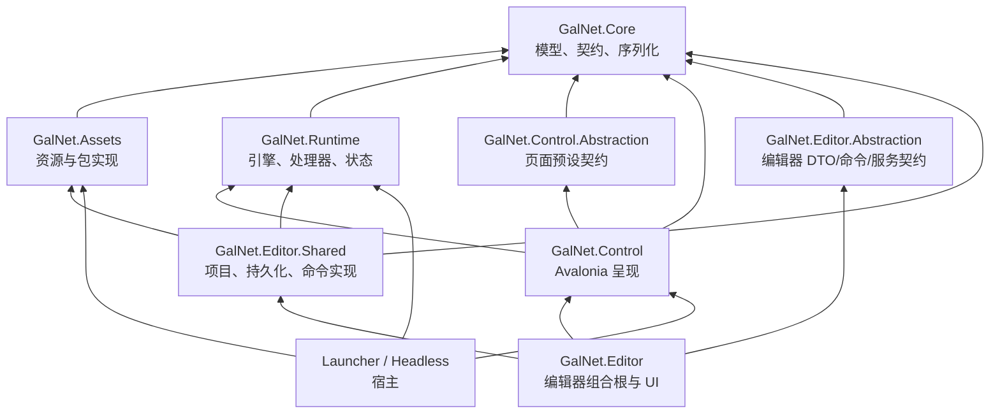
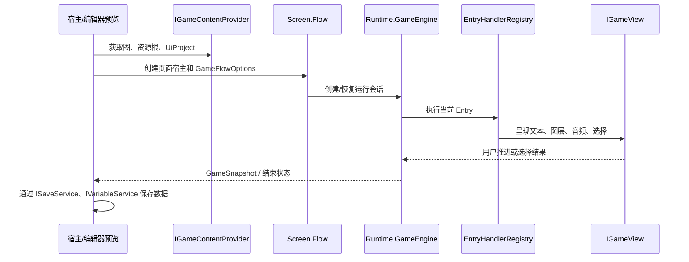
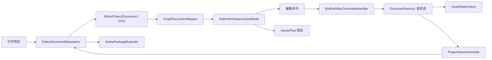

# GalNet 架构

## 目标与边界

GalNet 是一个 Galgame 内容制作与运行平台。设计目标是让游戏逻辑、运行时执行、平台 UI 和编辑器工作流彼此独立：内容可以在编辑器预览、桌面启动器和无头测试中运行，而不依赖某个具体宿主。

`Core` 只定义稳定的领域模型与协议；实现程序集只能依赖更底层的程序集。项目文件、`.galgroup`、资源包和存档是长期兼容边界，重构不得随意修改其字段和含义。

## 解决方案与依赖方向

| 程序集 | 职责 | 不应承担的职责 |
|---|---|---|
| `GalNet.Core` | 图、条目、变量、场景、设置、接口和文件模型 | Avalonia 控件、磁盘路径推断、DI 注册 |
| `GalNet.Assets` | 目录与 pak 资源提供者、压缩、加密、资源索引 | 游戏流程或 UI 逻辑 |
| `GalNet.Runtime` | 图加载、`GameEngine`、条目处理器、快照和变量运行态 | 具体窗口、控件或文件选择器 |
| `GalNet.Control` | Avalonia 页面、默认游戏视图、媒体适配、页面路由 | 编辑器项目持久化 |
| `GalNet.Editor.Abstraction` | 编辑器命令、DTO、服务接口、扩展点 | Avalonia 或磁盘实现 |
| `GalNet.Editor.Shared` | 项目读写、命令执行、导出、编辑器专用服务 | 编辑器窗口和控件 |
| `GalNet.Editor` | 组合根、编辑器页面、Dock、ViewModel | 持久化格式和运行时规则 |

依赖必须自上而下传递，禁止 `Core` 引用实现程序集；禁止 `Runtime` 引用 `Control`；禁止 `Editor.Shared` 引用 `Editor`。宿主负责选择内容提供者、玩家数据服务、平台窗口与 DI 生命周期。

## 游戏运行数据流

`IGameContentProvider` 提供游戏内容；`ISettingsService`、`ISaveService`、`IVariableService` 和 `IGameProgressService` 由宿主提供玩家数据。`GameEngine` 只解释图和条目，所有可见行为经 `IGameView` 完成。默认 Avalonia 实现位于 `GalNet.Control.Runtime.Presentation`，包含文本、选择、图层、音频、视频、转场和效果的适配器。

## Control 页面与 UI 预设

`GalNet.Control.Screen` 的每个功能目录同时拥有 View、ViewModel 和对应 XAML；其命名空间必须与物理路径一致。`Screen.Flow` 是页面创建边界，按 `title`、`game`、`settings`、`save-load`、`gallery`、`about` 路由，并为一次游戏运行维护其 ViewModel 生命周期。

`UiProject` 保存页面预设 ID 与用户覆盖值。`IUiPresetRegistry` 提供预设默认值；页面工厂合并“预设默认值 + 项目覆盖值”后生成不可持久化的页面配置对象。配置解析不得修改原始 `UiProject`，也不得让页面直接读取 JSON 或文件系统。

新增页面时：定义 `UiPageKind` 和预设元数据；在 `Screen/<Feature>` 放置同名 View/ViewModel/XAML；在 Flow 注册创建分支和 DataTemplate；最后补充路由与配置解析测试。

## 编辑器数据流

编辑操作必须以 `IProjectEditCommand` 表达。命令处理器负责校验并原子地修改 DTO，返回诊断与历史描述；UI 不得绕过命令直接改持久化模型。`GraphDocumentMapper` 在 DTO 与编辑器展示模型间转换，`GraphChangeTracker` 将展示层改动汇入脏状态，`ProjectSaveScheduler` 合并保存请求。预览通过 `IGameContentProvider` 使用当前项目内容，不读取示例目录或猜测资源路径。

## 扩展点

- 新增条目：在 `Core.Entry` 声明类型和参数，在 `Runtime.Handlers` 注册处理器，并补充文件格式和运行时测试。
- 新增编辑器命令：在 `Editor.Abstraction.Commands` 声明 record，在命令领域处理器实现校验和执行，并为成功、无效输入和历史记录编写测试。
- 新增资源来源：实现 `IAssetProvider`，由宿主或编辑器资产管理器组合，不把路径规则带入 Core。
- 新增平台宿主：实现内容与玩家服务契约，注册 Control/Runtime 所需服务，保持宿主专有代码在入口程序集内。

## 维护规则

源文件目录、C# 命名空间和 Avalonia `x:Class` 必须一致；生成目录 `bin`、`obj` 与临时目录不参与该检查。大类应按领域或生命周期拆分，单一协调器只保留路由和依赖组装。任何结构重构完成后至少运行相关测试、项目构建和命名空间一致性检查。
