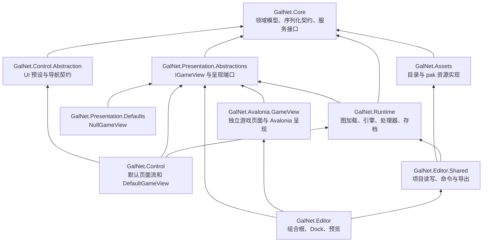
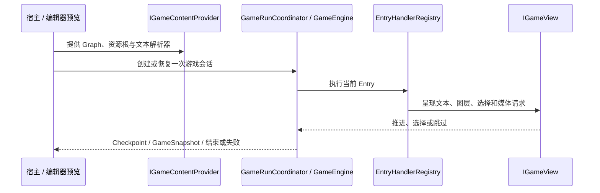

# GalNet 架构

## 分层与依赖

GalNet 将内容模型、运行时、呈现端口、Avalonia 页面和编辑器拆开。`Core` 不引用 UI、磁盘或 DI；Runtime 只依赖 Core 与呈现抽象，宿主负责组装具体实现。

```mermaid
flowchart BT
  Core["GalNet.Core\n领域模型、序列化契约、服务接口"]
  Presentation["GalNet.Presentation.Abstractions\nIGameView 与呈现端口"] --> Core
  Runtime["GalNet.Runtime\n图加载、引擎、处理器、存档"] --> Core
  Runtime --> Presentation
  Defaults["GalNet.Presentation.Defaults\nNullGameView"] --> Presentation
  Assets["GalNet.Assets\n目录与 pak 资源实现"] --> Core
  ControlAbs["GalNet.Control.Abstraction\nUI 预设与导航契约"] --> Core
  Control["GalNet.Control\n默认页面流和 DefaultGameView"] --> Runtime
  Control --> Presentation
  Control --> ControlAbs
  GameView["GalNet.Avalonia.GameView\n独立游戏页面与 Avalonia 呈现"] --> Presentation
  EditorShared["GalNet.Editor.Shared\n项目读写、命令与导出"] --> Runtime
  EditorShared --> Assets
  Editor["GalNet.Editor\n组合根、Dock、预览"] --> EditorShared
  Editor --> GameView
  Editor --> Presentation
```

| 程序集 | 当前职责 |
| --- | --- |
| `GalNet.Core` | 图、条目、原语/非原语编译、变量、场景、设置、序列化 DTO 与宿主服务接口 |
| `GalNet.Presentation.Abstractions` | `IGameView` 及文本、图层、交互、媒体、转场和效果端口 |
| `GalNet.Runtime` | Graph / 已编译 `.galgroup` 加载、`GameEngine`、原语条目处理器、运行态和存档 |
| `GalNet.Presentation.Defaults` | 无界面/默认呈现实现，供测试与简单宿主使用 |
| `GalNet.Assets` | 本地目录、pak、资源索引、压缩与缓存 |
| `GalNet.Control(.Abstraction)` | 固定默认页面流、UI 预设 schema、默认 Avalonia 游戏 View |
| `GalNet.Avalonia.GameView` | 页面导航、页面 View/VM 映射和 Avalonia 游戏画布呈现 |
| `GalNet.Editor.Abstraction` | 编辑器 DTO、命令和扩展契约 |
| `GalNet.Editor.Shared` | 项目读写、命令执行、变量/保存服务与导出 |
| `GalNet.Editor` | Avalonia 编辑器、Dock、预览与组合根 |

## 游戏运行

```mermaid
sequenceDiagram
  participant Host as 宿主 / 编辑器预览
  participant Content as IGameContentProvider
  participant Run as GameRunCoordinator / GameEngine
  participant Handlers as EntryHandlerRegistry
  participant View as IGameView
  Host->>Content: 提供 Graph、资源根与文本解析器
  Host->>Run: 创建或恢复一次游戏会话
  Run->>Handlers: 执行当前 Entry
  Handlers->>View: 呈现文本、图层、选择和媒体请求
  View-->>Run: 推进、选择或跳过
  Run-->>Host: Checkpoint / GameSnapshot / 结束或失败
```

`GameEngine` 保有 `IGameRuntime`，解释图的节点与条目；它不认识 Avalonia 控件。条目 Handler 将可见行为发送给 `IGameView`。图层和动画的长期状态在 Runtime 的场景实例中，呈现端只保存画面所需的短期状态。

## 编辑器工作流

编辑器以 `EditorProjectDocument` 为 UI 无关的编辑聚合。`EditorDocumentRepository` 负责 `Graph/graph.json` 与 `Graph/groups/*.rawgalgroup` 的读写；命令处理器原子修改该聚合，历史与保存调度器分别负责撤销/重做和合并写入。预览通过 `EditorGameDataProvider` 从当前项目内存状态建立内容：`GalgroupCompiler` 先将 Raw 条目编译为仅含原语的 `.galgroup`，再交给 Runtime，不依赖示例项目路径。

Dock 面板由 `IEditorExtensionRegistry` 注册，`EditorDockFactory` 管理其布局和生命周期。现有内置面板是节点图、游戏预览、资源、日志、组编辑器和检查器；检查器由当前活动面板的可选贡献提供。

## 维护规则

- 不让 Core、Runtime 或 Editor.Shared 反向引用 Avalonia 编辑器实现。
- 新原语条目必须同时更新 Core schema、Runtime Handler/注册、加载验证、测试和 `entry-types.md`；新非原语条目必须实现编译并覆盖其展开测试，不得注册 Runtime Handler。
- 新的持久化字段必须在 authoring JSON、加载器、导出包和兼容性测试中一起处理。
- 新呈现能力先增加 `Presentation.Abstractions` 端口，再由所需宿主实现；不要让 Runtime 直接调用 UI 类型。
