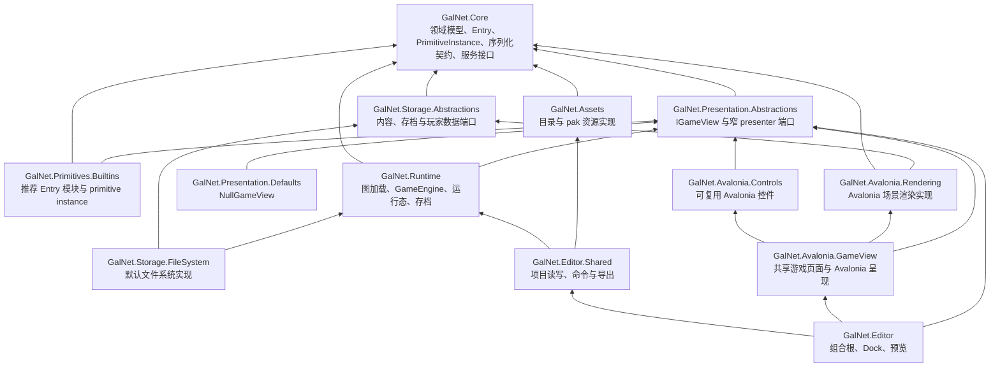
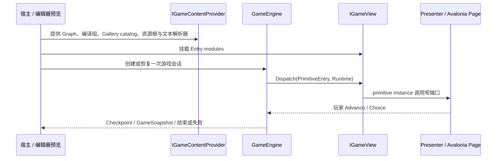

# GalNet 架构

## 分层与依赖

GalNet 将内容模型、运行时、呈现抽象、Avalonia 页面和编辑器拆开。`Core` 不引用 UI、磁盘或 DI；Runtime 只依赖 Core 与呈现抽象，宿主负责组装具体实现。

```mermaid
flowchart BT
  Core["GalNet.Core\n领域模型、Entry、PrimitiveInstance、序列化契约、服务接口"]
  Presentation["GalNet.Presentation.Abstractions\nIGameView 与窄 presenter 端口"] --> Core
  Builtins["GalNet.Primitives.Builtins\n推荐 Entry 模块与 primitive instance"] --> Core
  Builtins --> Presentation
  Runtime["GalNet.Runtime\n图加载、GameEngine、运行态、存档"] --> Core
  Runtime --> Presentation
  Defaults["GalNet.Presentation.Defaults\nNullGameView"] --> Presentation
  Assets["GalNet.Assets\n目录与 pak 资源实现"] --> Core
  StorageAbs["GalNet.Storage.Abstractions\n内容、存档与玩家数据端口"] --> Core
  StorageFs["GalNet.Storage.FileSystem\n默认文件系统实现"] --> StorageAbs
  StorageFs --> Runtime
  AvaloniaControls["GalNet.Avalonia.Controls\n可复用 Avalonia 控件"] --> Presentation
  AvaloniaRendering["GalNet.Avalonia.Rendering\nAvalonia 场景渲染实现"] --> Core
  AvaloniaRendering --> StorageAbs
  GameView["GalNet.Avalonia.GameView\n共享游戏页面与 Avalonia 呈现"] --> AvaloniaControls
  GameView --> AvaloniaRendering
  GameView --> Presentation
  EditorShared["GalNet.Editor.Shared\n项目读写、命令与导出"] --> Runtime
  EditorShared --> Assets
  Editor["GalNet.Editor\n组合根、Dock、预览"] --> EditorShared
  Editor --> GameView
  Editor --> Presentation
```

| 程序集 | 当前职责 |
| --- | --- |
| `GalNet.Core` | 图、Entry 定义、primitive/composite 编译模型、PrimitiveInstance、变量、场景、Gallery catalog、设置、序列化 DTO 与宿主服务接口 |
| `GalNet.Presentation.Abstractions` | `IGameView`、`IChoicePresenter`、`IDialoguePresenter`、`ILayerPresenter`、`IAnimationPresenter`、`IEffectPresenter` 等窄端口 |
| `GalNet.Primitives.Builtins` | 可选推荐 Entry 模块和对应 primitive instance 实现 |
| `GalNet.Runtime` | Graph / 已编译 `.galgroup` 加载、`GameEngine`、运行态和存档 |
| `GalNet.Presentation.Defaults` | 无界面/默认呈现实现，供测试与简单宿主使用 |
| `GalNet.Assets` | 本地目录、pak、资源索引、压缩与缓存 |
| `GalNet.Storage.Abstractions` | 内容、资源、存档、玩家变量和游戏进度端口 |
| `GalNet.Storage.FileSystem` | 默认目录内容（含可选 `gallery.json`）、存档、玩家变量和进度实现 |
| `GalNet.Avalonia.Controls` | 无样式/默认样式的可复用 Avalonia 游戏控件 |
| `GalNet.Avalonia.Rendering` | Avalonia 场景图层、纹理效果和粒子渲染实现 |
| `GalNet.Avalonia.GameView` | 页面导航、页面 View/VM 映射和 Avalonia 游戏画布呈现 |
| `GalNet.Editor.Abstraction` | 编辑器 DTO、命令和扩展契约 |
| `GalNet.Editor.Shared` | 项目读写、命令执行、变量/保存服务与导出 |
| `GalNet.Editor` | Avalonia 编辑器、Dock、预览与组合根 |

## 游戏运行

```mermaid
sequenceDiagram
  participant Host as 宿主 / 编辑器预览
  participant Content as IGameContentProvider
  participant Engine as GameEngine
  participant View as IGameView
  participant Presenter as Presenter / Avalonia Page
  Host->>Content: 提供 Graph、编译组、Gallery catalog、资源根与文本解析器
  Host->>View: 挂载 Entry modules
  Host->>Engine: 创建或恢复一次游戏会话
  Engine->>View: Dispatch(PrimitiveEntry, Runtime)
  View->>Presenter: primitive instance 调用窄端口
  Presenter-->>Engine: 玩家 Advance / Choice
  Engine-->>Host: Checkpoint / GameSnapshot / 结束或失败
```

`GameEngine` 保有 `IGameRuntime`，解释图的节点与条目；它不认识 Avalonia 控件。`IGameView` 只负责单条 primitive 的定义解析、参数规范化、实例创建和 dispatch。活动队列、skip batch、Choice、节点跳转和稳定快照都在 Engine 内。

`GameContent.Gallery` 是验证后冻结的静态内容目录：类型注册只包含 Gallery type ID 和资源类型字符串，item 只包含稳定 ID、类型引用、资源引用及可选展示元数据。目录内容提供者和 Editor Preview 从项目根目录的可选 `gallery.json` 建立该 catalog；缺少文件时使用空目录。Gallery catalog 不注册资源 decoder，也不包含 Avalonia 页面或导航信息。

每个 Gallery item 生成一个 `gallery_<item-id>_unlocked` 系统 Player bool。宿主在创建 Runtime 前把生成定义交给 `IVariableService`；`GalleryDataSource` 将静态 catalog 与当前 Player snapshot 合并为带 `IsUnlocked` 的只读结果。Gallery 解锁不存放在 `IGameProgressService`，因此剧情 primitive、条件表达式和 UI 查询观察同一变量真源。

Avalonia GameView 通过可选 `IGameGallerySession` 从宿主取得只读 Gallery 数据和资源 ID 到本地路径的解析器。标题页对零/单/多种有内容类型分别隐藏入口、直达内容页或显示类型选择页；renderer 先匹配内置 `typeId`，再按 `resourceType` 复用图片、视频或音频 UI，未知类型保留可诊断页面。图片 Bitmap、视频首帧缓存、LibVLC player、音频进度和全屏状态均只属于前端 game scope。宿主若替换资源存储或自定义页面，应实现资源解析器或通过 `AddAvaloniaGameViewPages` 的 view mapping 覆盖内容页；自定义 view 可从 `GalleryContentPageViewModel.GalleryType` 取得完整 registration 与 item snapshot。Gallery catalog 本身不理解路径、decoder 或 Avalonia 控件。GameView 只引用跨平台的 LibVLCSharp 托管绑定；Windows Sample 与 Editor 条件性携带 `VideoLAN.LibVLC.Windows`，其他平台的最终宿主必须提供对应的原生 LibVLC 运行时。

影响场景的 primitive 先更新 `SceneState`，再通知呈现端。图层、效果和动画的可存档事实在 Runtime 的场景状态中；呈现端只保存画面所需的短期状态。

## 编辑器工作流

编辑器以 `EditorProjectDocument` 为 UI 无关的编辑聚合。`EditorDocumentRepository` 负责 `Graph/graph.json`、`Graph/groups/*.rawgalgroup` 与项目根 `gallery.json` 的读写；命令处理器原子修改该聚合，历史与保存调度器分别负责撤销/重做和合并写入。资源检查器使用 `.meta` 中的稳定 asset ID 创建 Gallery item，资源移动或改名无需改 Gallery 引用；删除资源后导出校验会报告断链。

预览通过 `EditorGameDataProvider` 从当前项目内存状态建立内容：`GalgroupCompiler` 先将 Raw 条目编译为仅含 primitive 的 `.galgroup`，当前 Gallery catalog 同时写入预览临时目录，再交给 Runtime，不依赖示例项目路径。

Dock 面板由 `IEditorExtensionRegistry` 注册，`EditorDockFactory` 管理其布局和生命周期。现有内置面板是节点图、游戏预览、资源、日志、组编辑器和检查器；检查器由当前活动面板的可选贡献提供。

## 维护规则

- 不让 Core、Runtime 或 Editor.Shared 反向引用 Avalonia 编辑器实现。
- 新 primitive 应通过 Entry module 提供 schema 和 instance 工厂，并补编译、加载、运行时和文档测试。
- 新 composite entry 必须只在编译期展开为 primitive，不得注册 Runtime 执行入口。
- 新的持久化字段必须在 authoring JSON、加载器、导出包和兼容性测试中一起处理。
- 新呈现能力优先增加窄 presenter 端口或宿主模块能力，不让 Runtime 直接调用 UI 类型。
