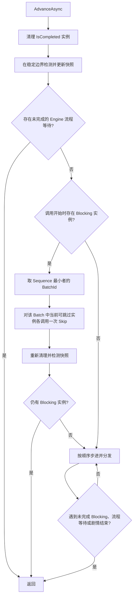
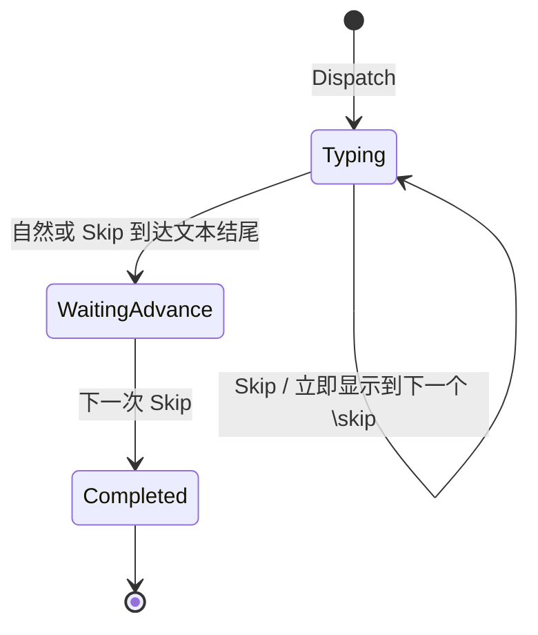

# Entry 模块与 PrimitiveInstance 设计

> 本文从已经确认的需求重新开始，不以当前工作树中的临时实现为设计依据。本文只描述目标设计，不代表现有代码已经实现。

## 1. 设计目标

Entry 系统只解决三件事：

1. 用模块组织编辑器可用的 Entry 定义。
2. 在编译期把 Composite Entry 展开为 Primitive Entry。
3. 在运行期由 `IGameView` 完成单条 primitive 的定义解析与调用，由 `GameEngine` 保存和调度 `PrimitiveInstance`。

设计应尽量少引入中间对象。一个概念只有在具有独立职责时才成为公共类型。

## 2. 总体结构

```text
Entry Module
├─ PrimitiveEntries  : IReadOnlyDictionary<string, PrimitiveEntryBase>
└─ CompositeEntries  : IReadOnlyDictionary<string, CompositeEntryBase>

Raw Entry
    │ 编译
    ▼
PrimitiveEntry[]
    │ GameEngine 步进 / IGameView 单条分发
    ▼
PrimitiveInstance[]
```

三个阶段的对象严格分离：

- `EntryBase` 及其派生类是模块中的定义，生命周期与模块一致。
- `PrimitiveEntry` 是编译后的数据，能够被序列化。
- `PrimitiveInstance` 是一次运行调用产生的状态对象，不参与内容序列化。

本文不再把“compiled envelope”当作额外架构概念。它只是“编译后的 primitive 调用记录”的旧称：内存对象是 `PrimitiveEntry`，写入 `.galgroup` 时的 DTO 是 `PrimitiveEntryDocument`，不需要再增加一个 Envelope 类型。

## 3. Entry Module

游戏可以挂载多个 Entry Module。每个模块只暴露两张只读表：

```csharp
IReadOnlyDictionary<string, PrimitiveEntryBase> PrimitiveEntries { get; }
IReadOnlyDictionary<string, CompositeEntryBase> CompositeEntries { get; }
```

约束：

- 两张表在模块构造完成后冻结。
- 表的 key 与 Entry 的 `Name` 一致。
- 同一模块内不能存在重复名称。
- 多个已挂载模块之间也不能存在重复名称。
- Primitive 和 Composite 不能注册同一个名称。
- 模块表是 Entry schema 的唯一真源；编辑器和编译器不能另外维护一套 Descriptor 表。

模块只负责组织 Entry 定义。除非具体模块确实持有资源，否则基础模块契约不强制加入生命周期、热加载或模块 ID 等额外概念。

## 4. Entry 定义

### 4.1 EntryBase

`EntryBase` 保存所有 Entry 定义共有的数据：

- `Name`
- 参数表
- 编辑器确实需要的少量展示元数据

参数表在构造后只读。参数的类型、必填性、默认值和约束都从这张表派生，不再复制为第二套 Primitive Descriptor。

### 4.2 PrimitiveEntryBase

`PrimitiveEntryBase` 在 `EntryBase` 基础上增加运行期职责：它既拥有该 primitive 的参数描述表，也负责根据一次编译后的调用创建独立的 `PrimitiveInstance`。

`PrimitiveEntryBase.Parameters` 是该 primitive 参数 schema 的唯一真源。编辑器表单、编译校验、默认值填充和运行期工厂都从同一张 `DynamicParameterTable` 读取参数定义，不再复制为第二套 Descriptor 表。

工厂创建实例时接收一次调用的创建上下文。为避免同一值出现两份可分歧的副本，建议结构为：

```text
PrimitiveCreateContext
├─ Definition        : PrimitiveEntryBase
├─ Entry             : PrimitiveEntry
├─ Runtime           : IGameRuntime
├─ ScopeCancellation : CancellationToken
├─ Parameters        : DynamicParameterTable  // Definition.Parameters 的只读别名
├─ Arguments         : JsonElement            // Entry.Arguments 的只读别名
└─ BatchId           : string?                // Entry.BatchId 的只读别名
```

每个 Entry 自己的 `Parameters` 属性是参数描述唯一来源。Core 提供无状态参数 helper，编辑器、编译器和 GameView 都只能通过这张表调用同一套校验、默认值填充和类型转换逻辑；Loader 只恢复结构化数据。进入工厂的 `Entry.Arguments` 必须已经是规范化结果，工厂不再自行补默认值。

每次调用工厂都必须返回新实例。定义对象不能保存某次调用的运行状态。

### 4.3 DefaultPrimitiveEntryBase

为了避免每个简单原语都创建一个 Entry 定义 CLR 类型，提供 `DefaultPrimitiveEntryBase`。

它在构造时接收参数描述表和一个 `Func`，工厂方法只负责调用这个 `Func`：

```text
DefaultPrimitiveEntryBase
    ├─ Parameters : DynamicParameterTable
    └─ factory(PrimitiveCreateContext) -> PrimitiveInstance
```

模块把 `DefaultPrimitiveEntryBase` 放进 Primitive 表即可。具体运行逻辑仍然由对应的 `PrimitiveInstance` 类承载。简单 primitive 可以在工厂里把参数 JSON 按 `Parameters` 反序列化成领域值，再把这些值和 `BatchId` 传给具体 instance 构造函数。

模块需要的运行时服务通过模块构造和工厂闭包提供，不为此增加 `PrimitiveInvocationOrigin`、`PrimitiveContext` 或 `PrimitiveInvocation` 等通用包装层。

### 4.4 CompositeEntryBase

Composite Entry 只在编辑器和编译期存在，运行时不直接执行。

它根据自身参数展开为零个或多个 `PrimitiveEntry`。如何划分 Batch 完全由这个 Composite 的语义决定：

- 可以让所有展开结果属于同一个 Batch。
- 可以把不同结果放进不同 Batch。
- 也可以不给某些结果显式分组，让编译器为这些结果生成独立 Batch。

框架不得规定“一个 Composite 等于一个 Batch”。

## 5. 编译后的 PrimitiveEntry

`PrimitiveEntry` 是运行时需要的通用调用数据，不为每种原语创建 CLR 数据类型。它至少包含：

- `TypeId`
- 参数 JSON
- `BatchId`
- 条件及现有编译格式所需的稳定 ID

参数描述表不放进 `PrimitiveEntry`，也不随每条调用重复序列化。它属于模块中的 `PrimitiveEntryBase` 定义；`PrimitiveEntry.TypeId` 在运行期关联到该定义。

`BatchId` 是编辑器/Composite 提供给一次 primitive 调用的可选局部分组参数。编译器把它写入 `PrimitiveEntry.BatchId`，GameView 构造实例时再原样传入 `PrimitiveInstance.BatchId`；框架不把它解释成全局身份，也不替内容生成全局稳定 ID。

BatchId 的匹配范围是“一次 Group 执行”。Engine 的活动记录额外保存内部 `GroupExecutionId`，实际批次键为 `(GroupExecutionId, PrimitiveInstance.BatchId)`。因此不同 Group、同一 Group 的不同再次进入都可以自由复用相同字符串，不会互相合批。BatchId 为空时，该实例只作为自己的独立批次；无需把运行期生成值写回 instance。

Composite 可以把自己的 `batchId` 参数原样赋给一个或多个展开结果，也可以给不同结果设置不同值。普通 Primitive Entry 同样可以在自己的参数描述表中暴露 `batchId`。BatchId 是普通 authoring 输入，但编译后提升到 `PrimitiveEntry.BatchId` 这个通用字段；工厂不再从领域参数 JSON 二次解释调度批次。

Batch 只表达“同一次 Group 执行中，当前活动实例响应同一次 Skip 的关联关系”，不是并发、事务或调度屏障。Engine 仍按编译顺序逐条调用 `Dispatch()`，遇到第一个未完成 Blocking 实例就停止分发；尚未分发的同 Batch 条目不属于当前 Skip。需要让 NonBlocking 呈现实例与后续 Blocking 实例同批响应时，Composite 必须先输出 NonBlocking 成员，再输出作为阻塞点的成员。

## 6. PrimitiveInstance

每个原语逻辑拥有自己的 `PrimitiveInstance` 派生类。公共基类保持最小，只包含：

- `IsBlocking`
- `IsSkippable`
- `IsCompleted`
- `BatchId`
- `Dispatch()`
- `Skip()`

### 6.1 状态约束

- `IsBlocking` 由实例语义决定，实例创建后不改变。
- `BatchId` 是实例所属的可选局部调度批次，实例创建后不改变，并且必须等于创建上下文中的 `BatchId`。
- `IsSkippable` 可以随实例阶段改变。
- `IsCompleted` 是唯一公共完成状态，只能从 `false` 变成 `true`。
- `Dispatch()` 对同一实例只执行一次。
- `Skip()` 只表示执行一次该实例定义的跳过行为，不保证实例完成。
- 是否完成必须在每轮调度时重新读取 `IsCompleted`，不能从“调用过 Skip”推断。

具体实例可以在内部保存 Task、CancellationTokenSource、动画游标或文本游标，但这些不是基础实例的公共状态。

调度器为了在异步工作自然完成后被唤醒，可以使用内部完成通知；该通知只是唤醒机制，完成事实仍以 `IsCompleted` 为准，不扩张成第二套公共状态。

`Dispatch()` 和 `Skip()` 的调用按调度器顺序串行发生，但 NonBlocking 实例可以在 `Dispatch()` 返回后继续异步呈现。此类实例必须在 `Dispatch()` 返回前同步提交最终可存档逻辑状态；后台工作只能更新可重建的呈现状态，并且必须自行观察异常、在所有终止路径上单调完成。若一个原语必须等待异步结果才能决定逻辑状态，它就不能声明为 NonBlocking。

动态 `IsSkippable` 只供 Engine 筛选候选实例。具体实例的 `Skip()` 必须在自己的锁或等价原子状态机内再次判断当前阶段并执行转换，保证异步自然推进与玩家 Advance 同时发生时不会跨错阶段；重复 Skip 必须幂等。

基础实例不提供通用 Result、ResultStatus 或 InvocationOrigin。条件、选项和节点跳转属于 Engine 内置控制流，不包装成 primitive，也不借此给所有 `PrimitiveInstance` 增加通用 Result。

### 6.2 Layer.Show 示例

`LayerShowPrimitiveInstance`：

- 固定 NonBlocking。
- 固定不可跳过。
- 构造时接收要显示的立绘及相关数据。
- 构造时接收本次调用的 BatchId。
- `Dispatch()` 更新场景状态并显示立绘，然后完成。
- `Skip()` 为空操作。

### 6.3 Animation 示例

`AnimationPrimitiveInstance`：

- Blocking 和 Skippable 从构造参数传入。
- BatchId 从本次调用传入，用于和其他活动实例合批跳过。
- `Dispatch()` 先提交可存档的最终逻辑状态，再启动异步呈现。
- `Skip()` 取消当前呈现任务，并把所有呈现值直接写到最终值。
- 完成或跳过收敛后把 `IsCompleted` 设为 `true`。

如果动画不可跳过，`Skip()` 不应被调度器调用。

## 7. GameView 与 Engine 的职责

`IGameView` 只负责一条 primitive 指令的调用：

- 挂载多个 Entry Module，并根据 `PrimitiveEntry.TypeId` 查找 `PrimitiveEntryBase`。
- 使用 Entry 自己的 `Parameters` 和共享参数 helper 规范化参数。
- 构造 `PrimitiveCreateContext`，调用工厂创建一次调用独占的 `PrimitiveInstance`。
- 验证 instance 的 BatchId 与 entry 一致，调用一次 `Dispatch()`，然后把 instance 返回给 Engine。

`IGameView` 不保存活动队列，不决定 Skip 批次，不推进 Group，不执行节点 Jump，也不更新快照。读取 TypeId、参数表和工厂的样板逻辑可以放入无状态静态 helper，但 helper 不拥有运行状态。

`GameEngine` 负责：

- 按游标读取、判断条件并逐条分发 Group 指令。
- 保存活动实例、Sequence 和当前 `GroupExecutionId`。
- 清理完成实例、选择 Skip 批次并执行 Advance。
- 在 Group 内容消费完毕后沿默认 edge 跳转；条件与 Choice 分支也只由 Engine 跳转。
- 更新稳定快照，以及在 Blocking 自然完成后继续步进。

Engine 的内部活动记录为：

```text
ActivePrimitive
├─ GroupExecutionId
├─ Sequence
└─ PrimitiveInstance
```

调度时从 `PrimitiveInstance.BatchId` 读取局部批次，并与 `GroupExecutionId` 组成实际匹配键。实现可以为了查询效率缓存 BatchId，但缓存值必须来自 instance，不能成为第三个可分歧的真源。

Blocking instance 的 `Completed` 由 Engine 订阅，用于排入一次无 Skip 权限的内部 continue。NonBlocking 完成不需要唤醒 Engine；Engine 在下一次 Advance、内部 continue、Group 结束和 Dispose 时统一移除所有已完成记录并解除事件订阅。对象只有在队列引用移除后才可被 GC 回收。

## 8. 唯一 Advance 规则

对玩家或 UI 只暴露 `GameEngine.AdvanceAsync`。不再公开 `Step`、`Pump`、`Update`、`SkipNextBatch` 等并列玩家入口。因为推进涉及活动实例、剧情游标、条件、分支和稳定快照，完整 Advance 和活动队列都由 Engine 拥有；`IGameView` 只执行单条 primitive 调用。

Engine 内部复用一个无 Skip 权限的 `ContinueUntilBlockedAsync`。Blocking 实例自然完成时只能请求这条内部路径，不能伪造玩家 Advance。

每次玩家 Advance 的规则：



具体约束：

1. 最早 Blocking 实例决定本次唯一有 Skip 权限的 `(GroupExecutionId, BatchId)`。
2. 同一次 Group 执行、同 Batch 的 NonBlocking 实例只要已经分发、仍未完成且当前可跳过，也必须收到 Skip；BatchId 为空时只处理决定阻塞的实例自身。
3. 不同 Batch 的实例本次绝不 Skip。
4. 当前 Batch 在 Skip 后仍有 Blocking 实例时，本次 Advance 立即返回。
5. 当前 Batch 在 Skip 后已经解除阻塞时，Engine 可以继续消费同步/NonBlocking 内容，直到遇到下一个 Blocking 实例或剧情结束；新遇到的 Blocking Batch 本次只建立阻塞，绝不再收到 Skip。
6. 如果当前 Blocking Batch 没有任何可跳过实例，本次 Advance 不产生效果，也不穿透它。
7. 调用开始时没有 Blocking 实例或 Engine 流程等待，则直接步进，直到遇到 Blocking 实例、Choice 等流程等待或剧情结束。

异步 Blocking 实例自然完成时，内部调度执行“清理、稳定快照检测、步进到下一个阻塞点”；这条路径没有 Skip 权限，也不是第二个玩家入口。

Engine 的队列修改、Blocking 完成通知和 Advance 必须通过同一个异步调度门串行处理。Blocking 完成事件只提交一次继续请求，不在事件回调中递归推进；重复通知合并，避免重入、重复清理或跨 Batch 跳过。NonBlocking 完成不提交继续请求。调用 `Dispatch()` / `Skip()` 时不持有 Engine 活动队列的内部锁。

### 8.1 Engine 内置控制流

条件分支、选项分支、边映射和节点跳转由 `GameEngine` 直接处理，不注册到 Entry Module，也不生成 `interaction.choice` 之类的 primitive：

- 条件分支由 Engine 求值并立即选择 edge，随后继续步进。
- Choice 分支由 Engine 求值并过滤可见选项，再把已经解析好的显示文本交给窄的 Choice 展示端口。
- 展示端口只返回“可见选项列表中的索引”；Engine 校验索引、映射回原 outlet/edge 并执行 Jump。
- Choice 等待是 Engine 自己的流程阻塞，不拥有 BatchId，不进入 `PrimitiveInstance` 活动队列，也不响应 Advance Skip。
- Choice 请求完成后只提交内部 continue 请求；Engine 在同一调度门内消费结果并继续到下一个阻塞点。
- Engine 同时只允许一个 pending Choice；Choice 是独立流程节点，不和 Group primitive 批次混合。

建议展示边界保持最小，例如：

```csharp
public interface IChoicePresenter
{
    Task<int> ChooseAsync(
        IReadOnlyList<string> options,
        CancellationToken cancellationToken);
}
```

Engine 启动 Choice 请求、记录 pending 对象后即退出调度门，不在门内等待用户输入。请求完成的 continuation 再排队进入调度门，并确认自己仍是当前 pending Choice 后才跳转；Restore 或 Dispose 取消并清除 pending 对象。无效索引视为展示端口契约错误，不得静默映射到其他 edge。

### 8.2 Animation Batch

动画时间线在本 feature 中作为一条普通 primitive entry 处理：它有自己的参数描述表，参数至少包含动画计划和可选 `batchId`。编译后 `batchId` 写入 `PrimitiveEntry.BatchId`，工厂构造一个 `AnimationPrimitiveInstance`，整个时间线只对应这一个 instance 和一个局部 BatchId。

本 feature 不设计“时间线内再嵌套并分发 Entry”。现有动画计划中的内部事件若继续保留，只能作为 animation 模块私有的时间线动作处理，不能按 TypeId 重新进入 Entry Module 或创建子 `PrimitiveInstance`；通用嵌套 Entry 留给后续独立设计。

## 9. Dialogue 与 `\skip`

`dialogue.text` 使用独立的 `DialoguePrimitiveInstance`。它同时管理打字机阶段和全文显示后的等待阶段。



规则：

- `\skip` 是不可见控制语法。
- 正常打字经过 `\skip` 时不暂停。
- 打字期间收到 Skip，只立即显示到下一个 `\skip` 或文本结尾。
- 跳到文本结尾的这次 Skip 不完成对话。
- 全文已经显示后，再收到一次 Skip 才完成对话实例。
- 连续 `\skip` 各自是独立边界，不能一次跨过多个边界。
- `\\` 表示字面反斜杠；转义规则复用现有打字机语法的读取方式。
- 普通文本与自定义富文本必须使用同一个控制指令识别器，避免两套语法行为不同。

`IsSkippable` 由对话实例当前阶段决定。Skip 可以改变它，但调用 Skip 本身不代表完成。

## 10. 快照边界

快照不要求活动实例队列完全为空。

只有同时满足以下条件时才能更新最后稳定快照：

1. 当前剧情游标已经提交到一个明确边界。
2. 当前不存在未完成的 Blocking 实例。
3. 当前不存在等待用户选择的 Engine 流程阻塞。

因此：

- Blocking 实例存在期间保留进入它之前的稳定快照。
- Choice 等待期间保留进入该分支之前的稳定快照；读档后由 Engine 重新求值并重新展示选项，不序列化 UI waiter。
- Blocking 实例完成并且剧情游标提交后，才能产生新快照。
- 未完成的 NonBlocking 实例不会单独阻止快照。
- NonBlocking 原语必须在 `Dispatch()` 中先提交最终逻辑状态，异步部分只负责呈现。
- 读档不恢复活动 Task 或 `PrimitiveInstance`；展示层根据已保存的最终逻辑状态重建画面。
- 循环播放等长期行为保存可序列化 Handle；负责启动它的 PrimitiveInstance 在 Handle 建立后即可完成。

Engine 分发一条 primitive 后立即提交“已消费该条目”的剧情游标，防止恢复调度时重复分发。若该实例仍 Blocking，最后稳定快照仍停留在分发前；待它完成后，内部继续路径先清理实例，再把已经提交的游标和最终逻辑状态写入新稳定快照。NonBlocking primitive 只有在 `Dispatch()` 返回前已经提交最终逻辑状态时，才允许游标和稳定快照继续前进。

目标设计不保留 `CreatesCheckpoint`。它是旧模型中用于标记“某类 primitive 分发前触发 checkpoint”的 Descriptor 元数据；新的 Engine 在每个满足上述条件的稳定边界统一更新最后稳定快照，不由模块或 primitive 决定是否创建 checkpoint。若宿主需要自动存档通知，应订阅 Engine 的稳定快照变化，而不是在 Entry schema 中增加该标记。

队列为空仍然是稳定状态，但不是更新快照的必要条件。

### 10.1 Gallery 当前实现与迁移边界

`gallery.unlock` 已是同步、NonBlocking primitive，接收稳定 Gallery item ID，经 `GalleryCatalog` 校验后写入生成的 Player bool。旧 `GalleryCategory`、零基 sequence ID、`IGameProgressService` Gallery API 与 progress JSON 的 `GalleryEntries` 已删除，不存在双写真源。

目标实现中 Gallery 仍是 GalNet 的内置能力，但不发展成拥有内容、UI、存储和生命周期的通用模块系统。Entry 模块只负责提供 `gallery.unlock` 的 authoring schema 与 primitive instance；Gallery catalog、玩家变量和 Avalonia 页面遵循各自已有的层级。`GameEngine` 不注册 Gallery 类型，也不认识图片、视频、音频或页面。

### 10.2 Gallery 数据契约（已确认）

Gallery Core 是平台无关的纯数据索引与状态查询。类型注册的最小语义只有 Gallery type ID 和适用的资源类型字符串：

```text
GalleryTypeRegistration
├─ TypeId            : string
└─ ResourceTypeName  : string
```

首轮内置注册预计包括：

```text
cg     -> sprite
video  -> video
audio  -> audio
```

未来可以注册 `scene -> galgroup`，但 galgroup 场景回放不属于首轮 UI。`ResourceTypeName` 是 Gallery 保存和传递的普通稳定字符串；Gallery 不负责动态注册资源类型、解析扩展名、选择 decoder 或验证 pak 的类型编码。当前资源系统仍以封闭的 `ResourceType` enum、`.meta` 中的字符串和编辑器硬编码扩展名推断共同工作，本 feature 只由宿主适配出字符串名称，不把资源系统整体模块化。

同一 Gallery type ID 只能注册一次。Gallery 不要求一个全局 `IGameModule`、模块生命周期或热加载；宿主只需在组合时聚合一组不可变的 registration。自定义 Gallery 类型可以使用已有资源类型字符串，也可以保留宿主认识而 Gallery 本身不理解的新字符串。

项目内容保存集中式 Gallery catalog，而不是把标注写回图片、音频、视频或 galgroup 源文件：

```text
GalleryItem
├─ Id          : string   // 全局唯一、创建后不可变
├─ TypeId      : string
├─ ResourceId  : string
├─ Title       : string?
└─ SortOrder   : int?
```

`GalleryCategory` enum、零基 `SequenceId` 和 `IsVideo` 不能作为目标身份或展示分派依据：封闭 enum 阻止自定义类型，序号会因重排改变，`IsVideo` 又把 UI 知识复制进 item。目标 catalog 使用字符串 `TypeId` 聚合，资源类型由对应 registration 给出，item 的 `Id` 承担唯一稳定身份。

Gallery 对外提供只读查询，返回所有有内容的类型，以及每种类型下的资源和当前解锁状态。接口形态可以是查询方法或不可变 snapshot，但必须表达等价数据：

```text
GalleryTypeData
├─ TypeId
├─ ResourceTypeName
└─ Items[]
   ├─ Id
   ├─ ResourceId
   ├─ Title
   ├─ SortOrder
   └─ IsUnlocked
```

数据层负责 type/item 唯一性、item 对注册类型的引用、资源类型字符串规范化和解锁状态合并；它不负责网格、列表、导航、缩略图、播放器或全屏页面。

### 10.3 Gallery 解锁变量（已确认）

每个 Gallery item 映射为一个保留的 Player bool，使 `gallery.unlock`、条件、脚本和其他 primitive 共享同一个状态面。变量名由不可变 item ID 确定性生成：

```text
item ID:       opening_movie
variable name: gallery_opening_movie_unlocked
runtime name:  player.gallery_opening_movie_unlocked
```

变量名不包含 `TypeId`，因此 item 从一种 Gallery 类型移动到另一种类型时不会丢失已解锁状态；也不能使用资源路径、标题或排序生成变量名。Item ID 必须符合可逆、无碰撞的变量名约束，创建后不得随资源改名而改变。

`gallery.unlock(itemId)` 先验证 item 存在，再通过 `IGameRuntime.SetVariable()` 把对应 Player bool 设为 `true` 并同步完成。通用变量 primitive 可以操作同一个规范名称。`GameSnapshot` 继续只保存 Save scope；Player variable store 负责跨存档槽持久化。

Gallery catalog 同时生成系统 Player 变量目录：每项是不可删除、默认 `false` 的 bool。Editor 的有效变量投影必须保留这些系统变量并拒绝用户定义冲突名称；文件变量服务必须把这些名称解析为 Player scope。Gallery 数据查询读取这组变量并只向 UI 暴露 `IsUnlocked`，UI 不需要拼接变量名或访问底层变量存储。

迁移时先建立 catalog 与系统变量投影，再把 `gallery.unlock` 从 `IGameProgressService` 切换到变量。随后移除 `IGameProgressService` 的 Gallery 专用 API 和 progress JSON 中的 `GalleryEntries`；若已有发行数据需要兼容，只允许进行一次旧集合到 Player bool 的导入，不长期双写两套真源。

### 10.4 Editor 资源标注与聚合

Editor 根据当前所选资源的类型字符串，反查所有匹配的 `GalleryTypeRegistration`，向用户提供“标记为 Gallery”及可选类型。例如 image/sprite 资源可以标记为 `cg`，同一资源类型以后也可以同时出现 `wallpaper` 等自定义 Gallery 类型。

确认标注后，Editor 只在集中 catalog 中创建或更新 `GalleryItem`。资源重命名由现有资源身份/路径维护机制更新引用；原始媒体文件不嵌入 GalNet 元数据。预览内容提供者与导出链必须把同一 catalog 放进 `GameContent`，保证 Editor Preview、目录运行和发行包观察到相同数据。

本阶段不要求资源类型本身动态模块化。对于当前 enum 中已有类型，适配器输出规范字符串；对于 `.galgroup` 这类不经过 `IAssetManager` 的内容，可以由 Editor/内容提供者在未来显式提供 `galgroup` 字符串。字符串未知时 Gallery 保留数据并产生诊断，不擅自把它解释成某种媒体。

### 10.5 Avalonia Gallery 前端

Avalonia 只依赖 Gallery 的只读数据结果，自主决定导航与展示：

- 没有任何有内容的 Gallery 类型时，标题页入口隐藏或禁用。
- 只有一种有内容的类型时，直接进入对应内容页面，不把一个不可见的选择页留在返回历史中。
- 有多种类型时，先进入 Gallery 类型选择页，再进入选中的内容页面。

前端首先按 Gallery `TypeId` 查找可选的专用 UI；没有专用 UI 时可按 `ResourceTypeName` 使用默认 UI。因此 `wallpaper -> sprite` 可以直接复用图片 Gallery，而真正不同的自定义类型才需要宿主手工提供 Avalonia UI。这个解析规则完全属于前端，不需要把 `RendererId`、ViewModel 类型或页面路由写入 Gallery Core。

首轮默认 UI：

- 图片：类似存档槽的网格；未解锁项显示纯色/弱化占位和右下角“未解锁”，已解锁项显示缩略图，点击后进入完整图片查看页。
- 视频：使用相同的卡片式网格；已解锁项显示预生成或缓存的首帧缩略图，点击后进入完整视频播放页。
- 音频：使用逐行列表，显示曲名、播放/暂停、时间和进度；同一前端会话只维护一个活动音频播放项。

UI 可以接收完整 `GalleryTypeData` 集合或通过 data source 查询。媒体播放进度、当前选中项、缩略图缓存和全屏状态都是短期呈现状态，不写入 Gallery catalog、Player variable 或 `GameSnapshot`。锁定状态不能只靠灰度颜色表达，必须同时有文本或图标。

### 10.6 延后能力与风险

场景 Gallery 最终可以使用 `scene -> galgroup` registration，但点击场景不能直接在当前游戏会话中 Jump：回放剧情可能修改变量、存档位置和解锁状态。它需要隔离的 replay session、明确的退出返回和存档策略，因此作为后续独立切片，不阻塞图片、视频和音频 Gallery。

资源类型字符串降低了 Gallery 与现有 enum 的耦合，但也引入拼写、大小写和未知值风险。组合时必须规范化并拒绝重复 Gallery type ID；Editor 应对当前宿主不认识的资源类型给出诊断。是否将整个资源类型系统改造成动态 registry，待出现 Gallery 之外的第二个明确消费者后再设计。

## 11. 明确不引入的公共抽象

本设计不需要下列公共运行时概念：

- `PrimitiveInvocationOrigin`
- `PrimitiveContext`
- `PrimitiveInvocation`
- `PrimitiveDescriptor` / `CreatesCheckpoint`
- `PrimitiveResult` / `PrimitiveResultStatus`
- `interaction.choice` 等把 Engine 控制流伪装成 primitive 的入口
- `PrimitiveDispatch`
- `PrimitiveExecutionPolicy`
- `PrimitiveExecutionControl`
- `IPrimitiveHandler`
- `OperationManager`

如果后续发现其中某个能力确实无法由现有对象承担，必须先说明具体使用场景和不可替代性，再单独修改设计；不能为了迁移旧代码而默认保留。

## 12. 文件与命名空间规则

新增和重写的代码遵循以下规则：

- 一个可独立引用的公共顶层类型放在一个同名文件中。
- 文件名与主要类型名一致。
- 只有只服务当前类型的私有嵌套类型可以留在同一文件。
- 小型且不可独立使用的内部实现可以与唯一使用者同文件。
- 相似类型通过相同目录和命名空间组织，不通过 `*Contracts.cs`、`*Entries.cs` 之类的大文件堆叠。
- 不把多个公共类压缩成单行声明。

建议目录关系：

```text
Core/Entry/
├─ EntryBase.cs
├─ PrimitiveEntry.cs
├─ PrimitiveEntryBase.cs
├─ DefaultPrimitiveEntryBase.cs
├─ CompositeEntryBase.cs
├─ PrimitiveArgumentHelper.cs
└─ IEntryModule.cs

Core/Primitives/
└─ PrimitiveInstance.cs

Presentation.Abstractions/View/
├─ IGameView.cs
└─ IChoicePresenter.cs

Primitives.Builtins/<Module>/
├─ <Module>EntryModule.cs
└─ <Concrete>PrimitiveInstance.cs
```

实际目录可以随程序集边界调整，但公共类型与文件的对应关系保持不变。

## 13. 兼容与迁移边界

- Raw 内容中的 Composite Entry 必须在编译期完全展开。
- Compiled 内容只包含通用 `PrimitiveEntry`。
- 不序列化 `PrimitiveInstance`、Task、CancellationTokenSource 或平台控件。
- Core 和 Runtime 不引用 Avalonia 等具体 UI 类型。
- BatchId 只在一次 Group 执行内匹配；不同 Group 或重复进入同一 Group 可以复用相同值。
- 动画计划作为单个 primitive instance；通用时间线嵌套 Entry 不属于本 feature。
- 现有 `\n`、`\dN`、`\d{N}`、`\d-` 行为保留；`\skip` 是新增语法，不复用 `\d-`。
- “非原语 Entry”统一改称 “Composite Entry”。

## 14. 验收场景

设计实现后至少覆盖：

1. 多个模块挂载以及两张只读表的重复项检查。
2. `DefaultPrimitiveEntryBase` 每次调用工厂都生成独立实例。
3. 工厂上下文暴露 primitive 参数表、规范化参数 JSON、Runtime 和本次 BatchId。
4. 编辑器传入的可选 BatchId 经 `PrimitiveEntry` 原样传到 `PrimitiveInstance`；空值表示实例独立成批。
5. 创建后的 `PrimitiveInstance` 暴露同一次调用的 BatchId。
6. Composite 展开结果全部同 Batch。
7. Composite 展开结果分成两个或更多 Batch。
8. 同一次 Group 执行、同 Batch 的 Blocking 与 NonBlocking 可跳过实例一起收到 Skip；跨 Group 同名 Batch 不关联。
9. 一次 Advance 可以在解除当前阻塞后步进到下一 Blocking Batch，但不 Skip 新遇到的 Batch。
10. Blocking 不可跳过时 Advance 不穿透。
11. 实例自然完成后内部继续到下一阻塞点，但不获得 Skip 权限。
12. Dialogue 连续多次 Advance 依次停在每个 `\skip` 和文本结尾。
13. 全文显示后的下一次 Advance 才完成 Dialogue。
14. 活动 NonBlocking 实例存在时可以更新稳定快照。
15. Blocking 实例完成和游标提交前不能覆盖旧快照。
16. 存档和读档不包含活动实例或异步任务。
17. GameView 不保存活动实例；Engine 在步进与 Dispose 时移除已完成 NonBlocking 引用。
18. 新增公共类型符合一文件一主要类型规则。
19. NonBlocking 原语在 Dispatch 返回前提交最终逻辑状态，异步呈现不会改变存档事实。
20. 条件和 Choice 分支由 Engine 内置处理；Choice 展示端口只返回可见索引，模块与 PrimitiveInstance 不决定流程跳转。
21. Choice 等待不持有调度门，Advance 不能跳过 Choice，读档会重新展示选项。
22. 动画时间线只创建一个 instance；内部事件不作为嵌套 Entry 分发。
23. 稳定快照更新不依赖 `CreatesCheckpoint` 或其他 primitive 元数据。
